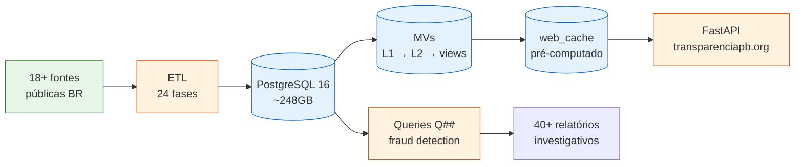
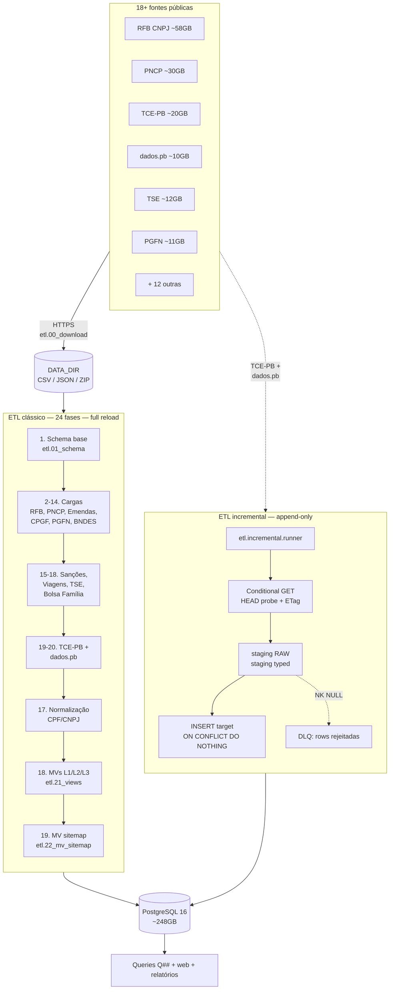
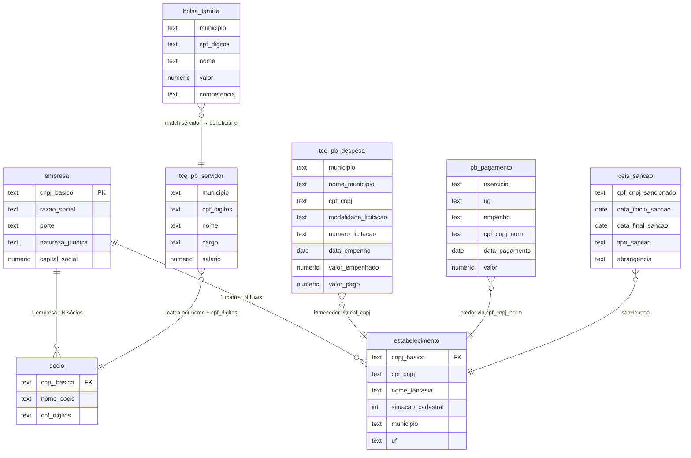
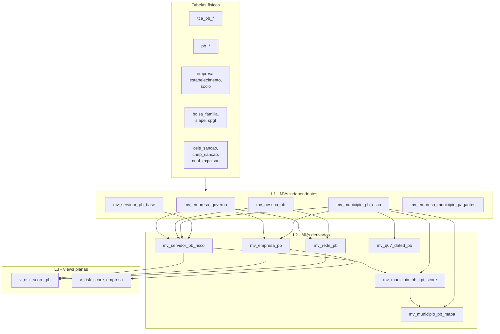
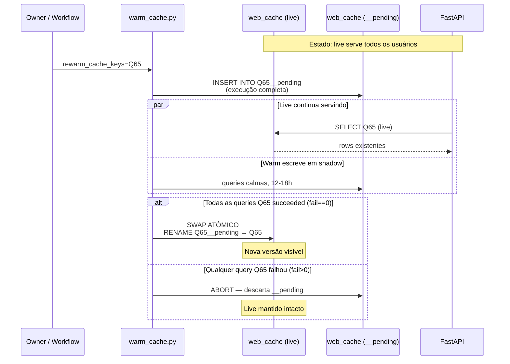
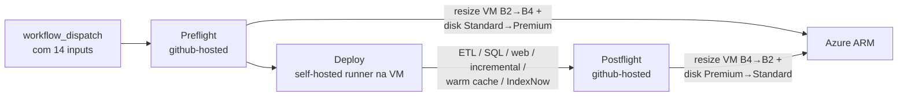

# Arquitetura

Visão geral arquitetural do `govbr-cruza-dados` — pensada como ponto único de entrada para contributors externos entenderem como as peças se encaixam. Este documento é a **landing page**; cada componente tem doc dedicado que aprofunda. Para vocabulário do domínio público brasileiro (empenho, UG, CEIS, etc.), veja [`glossario.md`](glossario.md).

## TL;DR

O projeto faz ETL de ~350M registros de ~18 fontes públicas brasileiras para PostgreSQL 16, normaliza identidades por CPF/CNPJ, materializa scores de risco em camadas, e serve o resultado via FastAPI no portal público [transparenciapb.org](https://transparenciapb.org). Tudo orquestrado por GitHub Actions sobre um self-hosted runner em Azure VM.



## Camadas

1. **Ingestão de dados brutos** — 18 fontes públicas baixadas como CSVs/JSONs em `$DATA_DIR`. Owner: `etl/00_download.py`.
2. **ETL clássico** — 24 fases (full reload, TRUNCATE+rebuild) carregando do raw para tabelas físicas. Owner: `etl/run_all.py`.
3. **ETL incremental** — framework dedicado em `etl/incremental/` para fontes append-only (TCE-PB, dados.pb hoje). Princípios não-negociáveis P1-P6. Owner: [`etl/incremental/README.md`](../etl/incremental/README.md).
4. **Schema** — DDL numerada em `sql/00_*.sql` a `sql/35d_*.sql`, executada pelo `etl.db.execute_sql_file`.
5. **Materialized Views em camadas** — `sql/12_views.sql`. L1 (independentes) → L2 (derivadas) → views planas. Detalhes em [`mv-guide.md`](mv-guide.md).
6. **Entity Resolution** — fase 17 (`etl/15_normalizar.py`) cria colunas `cpf_digitos` e `cpf_cnpj_norm` que permitem JOINs cross-source por igualdade direta.
7. **Queries Q##** — `queries/*.sql` com 125+ queries de fraude, numeradas globalmente Q01-Q310. Executadas por `etl/run_queries.py`. Detalhes em [`queries-guide.md`](queries-guide.md).
8. **Web frontend** — FastAPI + Jinja2 servindo cache pré-computado, com *shadow rewarm* zero-downtime. Detalhes em [`web-guide.md`](web-guide.md) e [`cache.md`](cache.md).
9. **Deploy** — workflow GitHub Actions com auto-resize de VM Azure. Detalhes em [`deploy.md`](deploy.md).
10. **Observabilidade** — Umami self-hosted + GoAccess + traffic-digest + pg-autotune. Detalhes em [`ops.md`](ops.md).

## Data flow ETL



ETL clássico e incremental coexistem para fontes diferentes — o incremental cobre TCE-PB e dados.pb (20 specs, ~40M rows); o clássico cobre todas as outras. Quando uma fonte clássica migra para incremental, ela sai da lista de `etl/run_all.py` e ganha `LoaderSpec` em `etl/incremental/specs/`.

## Entity Resolution (CPF/CNPJ)

CPFs aparecem mascarados em formatos diferentes por fonte. JOINs cross-source não funcionariam com `LIKE` / regex em 350M linhas. Solução: normalização na fase 17.

```mermaid
flowchart LR
    subgraph FONTES[CPF em 7 formatos diferentes]
        direction TB
        F1["Bolsa Família / SIAPE / CPGF<br/><code>***.456.789-**</code><br/>6 dígitos centrais"]
        F2["Sócio RFB<br/><code>***456789**</code><br/>sem pontuação"]
        F3["PGFN<br/><code>XXX456.789XX</code><br/>formato próprio"]
        F4["CEIS / CNEP<br/><code>12345678901</code><br/>completo (raro)"]
        F5["TCE-PB servidor<br/><code>***.456.789-**</code>"]
        F6["dados.pb pagamento<br/><code>00045678901</code><br/>completo!"]
        F7["dados.pb empenho PF<br/><code>***456***</code><br/>3 dígitos centrais"]
    end

    FONTES -->|Phase 17<br/>etl.15_normalizar| NORM[Funções utilitárias<br/><code>clean_cpf, clean_cnpj,<br/>extract_cpf_masked</code>]

    NORM --> COL1[("<b>cpf_digitos</b><br/>6 dígitos centrais<br/>indexed"]
    NORM --> COL2[("<b>cpf_cnpj_norm</b><br/>11 ou 14 dígitos<br/>indexed")]

    COL1 --> MATCH[JOIN por igualdade<br/>direta + nome normalizado]
    COL2 --> MATCH
```

**Caveat importante**: ao identificar fornecedores em queries, use **`cpf_cnpj` completo (14 dígitos)** — não `cnpj_basico` (8 dígitos), que sofre colisão com CPFs cujos primeiros 8 dígitos coincidem com algum CNPJ. Filtre com `EXISTS (SELECT 1 FROM estabelecimento WHERE cpf_cnpj = ...)` para excluir falsos positivos. Detalhes em [`queries-guide.md`](queries-guide.md).

## ERD principal

Visão simplificada das entidades centrais. Tabelas auxiliares (`dom_*`, `etl_*` audit, `pb_extras_*`) omitidas para clareza.



Relacionamentos não-mostrados por simplicidade:

- `pncp_*` (contratacao/contrato/item) → `estabelecimento` via `cpf_cnpj`
- `pb_empenho`, `pb_contrato`, `pb_liquidacao_*` → `pb_pagamento` por `(exercicio, ug, empenho)`
- `siape`, `cpgf`, `viagem` → `estabelecimento` / `socio` via `cpf_digitos` + nome
- `tse_*` (candidato, doador, patrimônio) → `socio` via `cpf_digitos` + nome
- `cnep_sancao`, `ceaf_expulsao`, `acordo_*` → similar a `ceis_sancao`

Para o catálogo completo de colunas das tabelas TCE-PB e dados.pb, veja [`dicionario_dados_pb.md`](dicionario_dados_pb.md).

## Materialized Views em camadas



Convenções estritas em `sql/12_views.sql`:

1. **DROP no topo do arquivo, em ordem reversa** — views planas primeiro, L2 depois, L1 por último
2. **Criação por camada** — L1 → L2 → views planas, na sequência
3. **`REFRESH MATERIALIZED VIEW CONCURRENTLY`** exige UNIQUE INDEX na MV
4. **Notas de refresh** no rodapé do arquivo documentam ordem em produção

Detalhes operacionais em [`mv-guide.md`](mv-guide.md).

## Web cache e shadow rewarm

A tabela `web_cache` armazena resultados pré-computados de queries pesadas. FastAPI lê dela diretamente em request time. Três modos de atualização:



**Outros modos**:

- **`drop_cache`** — TRUNCATE total. Causa 12-18h de cache miss em todas as queries. Só use em mudança de schema.
- **`invalidate_cache_keys`** — DELETE cirúrgico por prefixo de qid. Causa cache miss até warm rebuildar. Use só quando dados live estão *broken*.
- **`rewarm_cache_keys`** — shadow rewarm (acima). **Default recomendado**. Auto-expansão: `PERFIL` propaga para `KPI_SUMMARY` (mesmo prefixo).

Detalhes em [`cache.md`](cache.md). Documentação dos inputs do `deploy.yml` em [`deploy.md`](deploy.md).

## Deploy pipeline (resumo)



3 jobs encadeados com `concurrency.group` único para evitar dois deploys simultâneos quebrarem o banco. Custo médio mensal ~$104 (web base + 1 ETL + 1 warm/mês), prorateado por hora. Detalhes em [`deploy.md`](deploy.md).

## Componentes operacionais (transparenciapb.org)

| Serviço | Systemd unit | Função |
|---|---|---|
| Frontend FastAPI | `cruza-web` | Uvicorn :8000 |
| Warm cache | `cruza-warm-cache` | Type=oneshot, dispara via workflow |
| Umami analytics | `cruza-umami` | `/_traffic/analytics/` (basic-auth + login) |
| GoAccess | `cruza-goaccess` | Dashboard `/_traffic/goaccess/` |
| Traffic tail | `cruza-traffic-tail` | últimas N linhas raw |
| Traffic digest | `cruza-traffic-digest.{service,timer}` | cron diário |
| PG auto-tune | `pg-autotune` | recalcula `shared_buffers` etc. por RAM da VM |

Detalhes operacionais (runbooks de rollback, restore, troubleshoot warm, fail2ban) em [`ops.md`](ops.md).

## SEO

Camada de descobribilidade tratada como produto, com sitemap-index shardado, ~550k URLs cobertas, IndexNow, OG image dinâmica. README contém a seção dedicada `## SEO` com os detalhes técnicos.

## Convenções não-negociáveis

Cada uma com fundo arquitetural — quebrá-las introduz regressões silenciosas. Documentadas em [`../CONTRIBUTING.md`](../CONTRIBUTING.md):

1. **PT-BR em todo o projeto** — identificadores, comentários, SQL, commits
2. **Sem pandas** — RAM budget 16GB sobre 350M rows. Streaming line-by-line + `COPY FROM STDIN` (helpers em `etl/db.py`). ADR-001.
3. **MVs em camadas L1→L2→views planas** — DROP reverso, REFRESH CONCURRENTLY. ADR-002.
4. **Shadow rewarm** como padrão de atualização de cache. ADR-003.
5. **Framework incremental dedicado** para fontes append-only, com role `etl_incremental` sem privilégios destrutivos. ADR-004.
6. **Header `-- Q##:` obrigatório** em `queries/*.sql` — sem ele o parser custom de `etl/run_queries.py` não detecta a query.
7. **`cpf_cnpj` (14 dígitos) para fornecedores**, não `cnpj_basico` (8) — colisão CPF/CNPJ.
8. **RFB usa latin-1**, outras fontes utf-8 — usar `latin1_lines` para RFB.

ADRs em [`adr/`](adr/) detalham o "porquê" de cada decisão arquitetural inegociável.

## Hardest-to-onboard files

Para contributor novo, os 5 arquivos com maior densidade conceitual:

| Arquivo | Linhas | Por que difícil |
|---|---|---|
| `sql/12_views.sql` | 1500+ | MVs em 3 camadas, DROP reverso no topo, dependências implícitas |
| `etl/run_all.py` | 800+ | 24 fases hardcoded, `_CSV_DIRS` vs `_SHARED_DIRS` cleanup automático |
| `web/routes/cidade.py` | 2100+ | SSR + APIs + cache + dialogs em um arquivo |
| `web/warm_cache.py` | 1700+ | Shadow rewarm, swap atômico, abort conditions, contextual rebuild |
| `etl/run_queries.py:split_sql_statements` | ~60 | Parser custom de SQL (quotes + dollar-quoting), processa 125+ Q## |

Os guias temáticos (`etl-guide.md`, `web-guide.md`, `mv-guide.md`, `queries-guide.md`, `cache.md`) destrincham cada um.

## Documentação adicional

| Doc | Para quem |
|---|---|
| [`../README.md`](../README.md) | Primeira leitura — quickstart + overview de features |
| [`../CONTRIBUTING.md`](../CONTRIBUTING.md) | Convenções + 3 caminhos de contribuição + setup local |
| [`glossario.md`](glossario.md) | Vocabulário do domínio (CEIS, empenho, UG, etc.) |
| [`onboarding.md`](onboarding.md) | Walk-through 15min clone → `uvicorn` |
| [`etl-guide.md`](etl-guide.md) | Adicionar fase ETL clássica |
| [`etl-incremental-guide.md`](etl-incremental-guide.md) | Adicionar spec incremental (P1-P6) |
| [`web-guide.md`](web-guide.md) | Adicionar query/rota/template/MD3 |
| [`queries-guide.md`](queries-guide.md) | Adicionar Q## (header, EXPLAIN, índice) |
| [`mv-guide.md`](mv-guide.md) | Adicionar MV (layered) |
| [`cache.md`](cache.md) | `web_cache` + shadow rewarm |
| [`deploy.md`](deploy.md) | 14 inputs `deploy.yml` + OIDC setup |
| [`ops.md`](ops.md) | Runbooks operacionais |
| [`privacidade.md`](privacidade.md) | Política LGPD pública |
| [`dicionario_dados_pb.md`](dicionario_dados_pb.md) | Catálogo de colunas TCE-PB e dados.pb |
| [`plano_novas_fontes.md`](plano_novas_fontes.md) | Roadmap de fontes (TSE histórico, etc.) |
| [`adr/`](adr/) | Decision records arquiteturais |
| [`../etl/incremental/README.md`](../etl/incremental/README.md) | Framework incremental detalhado |
| [`../DATA-LICENSE.md`](../DATA-LICENSE.md) | Licenciamento de dados + LGPD |
