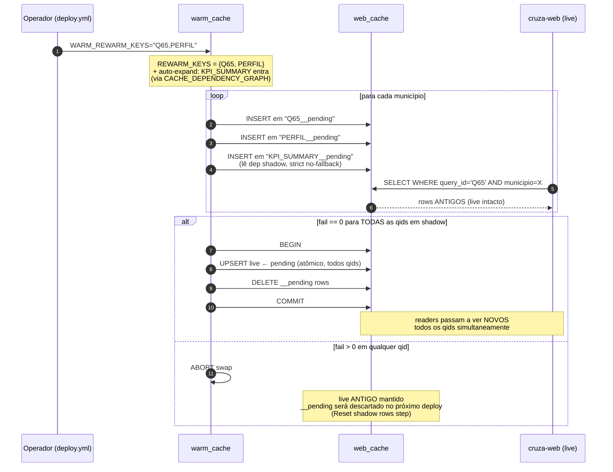

# Cache — `web_cache` + shadow rewarm

Este doc explica o pipeline de cache que sustenta `transparenciapb.org`. Para overview, ver [architecture.md](architecture.md); para operação via deploy, ver `docs/deploy.md` (a ser criado).

## Por que cache?

As Q## pesadas (Q65, Q67, Q70, KPI_SUMMARY, PERFIL...) levam de segundos a minutos no Postgres. Em request quente, o `TIMEOUT_PROFILE=3s` de [`web/config.py`](../web/config.py) tornaria essas páginas inviáveis. Solução: **pré-computar tudo offline** e servir HTML SSR lendo apenas de uma tabela. O FastAPI **nunca executa Q## pesada em request síncrono** — só lê `web_cache`.

## Schema da tabela

Definição real em [`web/warm_cache.py:41-51`](../web/warm_cache.py):

```sql
CREATE TABLE IF NOT EXISTS web_cache (
    query_id   TEXT NOT NULL,
    municipio  TEXT NOT NULL,
    columns    JSONB NOT NULL DEFAULT '[]',
    rows       JSONB NOT NULL DEFAULT '[]',
    row_count  INTEGER NOT NULL DEFAULT 0,
    updated_at TIMESTAMPTZ NOT NULL DEFAULT now(),
    PRIMARY KEY (query_id, municipio)
);
```

`query_id` carrega:

- **Q##** literal (ex: `Q65`) — variante all-time.
- **Prefixo temporal** (ex: `ANO:Q65`, `12M:Q65`) — variantes datadas.
- **Sufixo `__pending`** durante shadow rewarm (ver abaixo).
- **Keys especiais:** `PERFIL`, `TOP_FORNECEDORES`, `TOP_SERVIDORES`, `HEATMAP`, `KPI_SUMMARY`, `EMPRESA_PERFIL`.

## Warm cycle

```bash
python -m web.warm_cache --pb              # 1 ciclo: 223 munis PB
python -m web.warm_cache --daemon --loop   # contínuo, pausa de 60s entre ciclos
python -m web.warm_cache --mun "João Pessoa"
```

Configuração relevante:

- `WARM_CACHE_WORKERS=4` (default) — paralelismo de municípios.
- `WARM_WORK_MEM=192MB` por sessão (evita disk-based sorts).
- `WARM_SKIP_RECENT_HOURS=-1` (default) — **skip se já cacheado em qualquer idade**; dados governamentais são estáticos após ETL. Para rebuild forçado, use `drop_cache` ou `invalidate_cache_keys`.
- `TIMEOUT_PROFILE_WARM=600s` (10 min) por empresa em `compute_empresa_perfil_dict` — mega-empresas (BB, Caixa, INSS) têm milhões de empenhos.

## Shadow rewarm — zero downtime



Os comentários canônicos do mecanismo estão em [`web/warm_cache.py:94-178`](../web/warm_cache.py).

## 3 modos de atualização

| Modo | Operação | Downtime | Quando usar |
|---|---|---|---|
| **`drop_cache=true`** | `TRUNCATE web_cache` | **12-18h** (cache miss em TUDO até warm completar) | Mudança de schema, big rebuild |
| **`invalidate_cache_keys=Q65,PERFIL`** | `DELETE` cirúrgico HARD por prefixo | Cache miss até warm rebuildar essas chaves | Dados live **broken** (bug produziu lixo, precisa sumir já) |
| **`rewarm_cache_keys=Q65,PERFIL`** | Shadow rewarm + swap atômico | **Zero** | **Default recomendado** para atualizar dados |

## Auto-expansão

Quando você passa `rewarm_cache_keys=PERFIL`, o sistema **automaticamente** coloca em shadow qualquer **derived** que dependa de PERFIL no mesmo prefixo. Definido em `CACHE_DEPENDENCY_GRAPH` ([`web/warm_cache.py:193-195`](../web/warm_cache.py)):

```python
CACHE_DEPENDENCY_GRAPH = {
    "KPI_SUMMARY": ["PERFIL", "TOP_FORNECEDORES", "TOP_SERVIDORES"],
}
```

Sem isso, `KPI_SUMMARY` continuaria sendo computado lendo `PERFIL` **velho** do live durante o warm, e o swap deixaria o UI inconsistente.

## Match semantics

Match é **exato**, não substring. Padrão casa com:

- **`query_id` literal** (ex: `ANO:Q65` casa só `ANO:Q65`).
- **`base`** (qid sem prefixo): `Q65` casa `Q65`, `ANO:Q65`, `12M:Q65`.

```text
rewarm_cache_keys = "PERFIL"
✅ casa: PERFIL, ANO:PERFIL, 12M:PERFIL
❌ NÃO casa: EMPRESA_PERFIL  (base inteira é EMPRESA_PERFIL)
```

Decisão de design (PR #105 review): evitar que `PERFIL` dispare warm de ~143K empresas via `EMPRESA_PERFIL`. Use prefixos explícitos para escopar (`ANO:Q65` ≠ `Q65`).

## Endpoint admin

```bash
curl -X POST https://transparenciapb.org/api/cache/invalidate \
     -H "X-Admin-Token: $CACHE_INVALIDATE_TOKEN" \
     -H "Content-Type: application/json" \
     -d '{"prefix": "Q65"}'
```

- Implementado em [`web/routes/cidade.py:1406-1430`](../web/routes/cidade.py) (PR #118).
- **Fail-closed:** sem `CACHE_INVALIDATE_TOKEN` no `.env`, endpoint responde 503.
- Em **produção**, prefira o workflow `deploy.yml` (auditável, gera log, integrado ao rewarm).

## Caveats

- **Swap exige `fail == 0`** para essa qid. Uma única falha em qualquer município aborta o swap dessa qid; rows `__pending` ficam até o próximo deploy executar a etapa "Reset shadow rows".
- **Atomicity all-or-nothing:** o swap final é uma única transação cobrindo todas as qids elegíveis — readers nunca vêem derived NOVO + source VELHO. Em troca, basta uma qid falhar para abortar o swap **inteiro** desse ciclo.
- **Sem TTL automático:** cache não expira sozinho. Refresh acontece quando `deploy.yml` é executado com `rewarm_cache_keys`. Não há cron de rewarm automático (ainda).
- **`web_cache` cresce com dated:** cada Q## com `sql_full_dated` registra pelo menos all-time + ano-atual (`ANO:`), dobrando linhas. PB: ~223 munis × N queries × 2 variantes.
- **Cobertura mínima 80%** antes de `expose_empresa_sitemap=enable` no deploy — gate manual no `deploy.yml`.
- **Shadow rows persistem entre deploys?** Não. O step "Reset shadow rows" do `deploy.yml` deleta `*__pending` no início de cada deploy, evitando shadow stale quando o SQL mudou entre runs.

## Operações em produção

A receita operacional canônica (mudou SQL de uma query → quero atualizar cache sem downtime):

1. PR com a nova SQL.
2. Após merge, dispare `deploy.yml` com `rewarm_cache_keys=Q65,PERFIL` (vírgula separa múltiplas).
3. Workflow:
   - Sincroniza código.
   - Reseta shadow rows (`DELETE WHERE query_id LIKE '%__pending'`).
   - Roda `WARM_REWARM_KEYS=Q65,PERFIL python -m web.warm_cache --pb`.
   - Se fail==0: swap atômico. UI nunca viu cache stale.
   - Se fail>0: aborta swap; cache live antigo permanece servindo.

Detalhes completos dos inputs em `docs/deploy.md` (a ser criado por outro PR).

## Relacionados

- [architecture.md](architecture.md) — sequence diagram shadow rewarm em alto nível.
- [mv-guide.md](mv-guide.md) — mudou MV? Rewarm das Q## que a consomem.
- [queries-guide.md](queries-guide.md) — registrar a query é pré-requisito para o warmer encontrá-la.
- [web-guide.md](web-guide.md) — rotas cache-only (503 se miss) vs live fallback.
- Sample dump da tabela (uma vez disponível): `docs/sample-data.md`.
