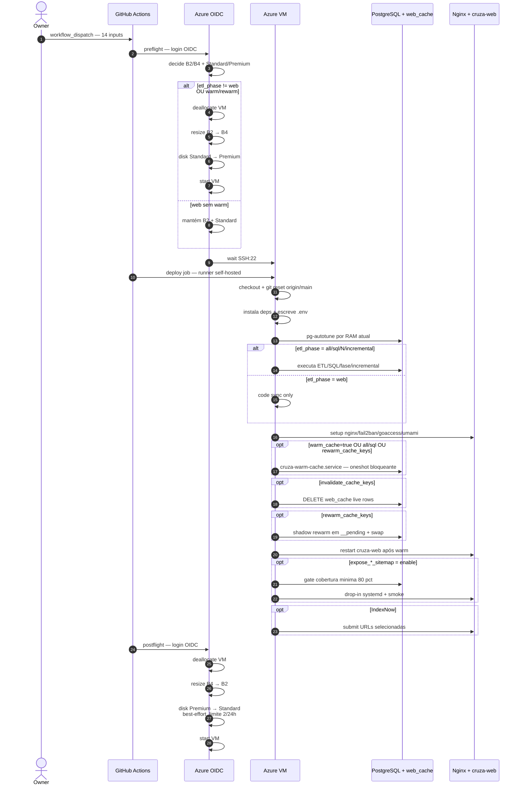

# Deploy pipeline

Deploy de produção do `govbr-cruza-dados` para a VM Azure que hospeda o [transparenciapb.org](https://transparenciapb.org). O pipeline roda via GitHub Actions com runner self-hosted na própria VM, usa OIDC para operar Azure sem segredo de Service Principal, e divide o trabalho em 3 jobs: `preflight`, `deploy` e `postflight` ([`../.github/workflows/deploy.yml`](../.github/workflows/deploy.yml), linhas 3-6 e 149-153).

A VM fica barata em modo web (`Standard_B2as_v2` + Standard SSD) e sobe temporariamente para ETL/warm (`Standard_B4as_v2` + Premium SSD) quando necessário. O custo base típico é cerca de **US$ 104/mês**, com operações pesadas cobradas por hora extra.

## Visão geral



## Jobs do workflow

### 1. `preflight` - GitHub-hosted + OIDC

Roda em `ubuntu-latest` e decide o tamanho alvo da VM. Se `etl_phase=web`, `warm_cache=false` e `rewarm_cache_keys` vazio, mantém B2 + Standard SSD; qualquer trabalho pesado sobe para B4 + Premium SSD ([linhas 160-179](../.github/workflows/deploy.yml)). O login Azure usa `azure/login@v2` com OIDC ([linhas 181-186](../.github/workflows/deploy.yml)).

Quando há mudança necessária, o job desaloca a VM, redimensiona, converte o SKU do disco, garante cache `ReadOnly` no data disk e liga a VM novamente ([linhas 235-275](../.github/workflows/deploy.yml)). Depois espera SSH na porta 22 antes de liberar o runner self-hosted ([linhas 278-287](../.github/workflows/deploy.yml)).

### 2. `deploy` - self-hosted runner na VM

Roda dentro da VM (`runs-on: [self-hosted, linux, azure]`) com timeout de 5 dias ([linhas 292-296](../.github/workflows/deploy.yml)). O job sincroniza código, escreve `.env`, instala dependências, aplica schemas web, roda `pg-autotune`, verifica disco, executa ETL/SQL/fase/incremental conforme input, faz deploy do frontend e controla cache/sitemaps.

Ordem crítica:

1. Para daemon antigo de warm-cache e mascara timers de auto-update ([linhas 308-346](../.github/workflows/deploy.yml)).
2. `clean=true` derruba tabelas públicas e remove `.initialized`  **destrutivo** ([linhas 349-366](../.github/workflows/deploy.yml)).
3. Instala PostgreSQL 16/deps se ausentes ([linhas 369-417](../.github/workflows/deploy.yml)).
4. Faz clone/fetch/reset para `origin/main`, escreve `.env`, instala `pip install -e ".[web]"` ([linhas 419-482](../.github/workflows/deploy.yml)).
5. Aplica `pg-autotune.service` e reinicia PostgreSQL se o tuning mudou ([linhas 501-538](../.github/workflows/deploy.yml)).
6. Executa ETL conforme `etl_phase` ([linhas 573-683](../.github/workflows/deploy.yml)).
7. Instala/configura Nginx, Let's Encrypt, fail2ban, GoAccess, traffic digest, Umami e systemd services ([linhas 695-827](../.github/workflows/deploy.yml)).
8. Atualiza estatísticas hot e trata cache (`drop_cache`, skip mode, shadow reset, invalidate, warm) ([linhas 828-1164](../.github/workflows/deploy.yml)).
9. Reinicia `cruza-web` **após** warm para evitar janela longa de cache miss ([linhas 1166-1203](../.github/workflows/deploy.yml)).
10. Executa IndexNow/sitemaps/smokes e `etl.verify` ([linhas 1205-1850](../.github/workflows/deploy.yml)).

### 3. `postflight`  GitHub-hosted + OIDC

Roda só quando o deploy terminou com sucesso e houve motivo para upsize (`etl_phase != web`, `warm_cache=true` ou `rewarm_cache_keys` não vazio) ([linhas 1866-1872](../.github/workflows/deploy.yml)). Desaloca, volta para B2, tenta converter disco de volta para Standard SSD e liga a VM ([linhas 1882-1956](../.github/workflows/deploy.yml)). A conversão do disco é best-effort porque Azure limita mudanças de SKU por disco.

## Inputs `workflow_dispatch`

Definidos em [`../.github/workflows/deploy.yml`](../.github/workflows/deploy.yml), linhas 27-109.

| Input | Tipo | Default | Função |
|---|---|---:|---|
| `etl_phase` | string | `all` | Seleciona o trabalho: `web`, `all`, `sql`, `incremental` ou fase numérica `N`. |
| `clean` | boolean | `false` | Reset destrutivo antes do deploy: remove `.initialized` e tenta dropar tabelas públicas. Use só para rebuild zero. |
| `skip_download` | boolean | `false` | Em `etl_phase=all`, pula download e começa de fase 2 usando arquivos já presentes em `DATA_DIR`. |
| `warm_cache` | boolean | `false` | Força execução do `cruza-warm-cache.service`. Também força B4/Premium no preflight. Para `etl_phase=web`, é opt-in explícito. |
| `run_queries` | boolean | `false` | Roda `python -m etl.run_queries` após ETL, exceto em deploy web. |
| `incremental_only` | csv/string | vazio | Limita specs do incremental, ex. `tce_pb.tce_pb_despesa,dados_pb.pb_pagamento`; só vale com `etl_phase=incremental`. |
| `drop_cache` | boolean | `false` | `TRUNCATE web_cache` antes do warm. Use apenas em mudança de schema do cache; causa cache miss até rebuild. |
| `invalidate_cache_keys` | csv/string | vazio | DELETE cirúrgico **HARD** de rows live em `web_cache` por substring de `query_id`. Sanitizado para `[A-Za-z0-9_:]`. |
| `rewarm_cache_keys` | csv/string | vazio | Shadow rewarm zero-downtime: escreve `<qid>__pending` e promove atomically se sucesso. Match exato/base. |
| `warm_skip_hours` | string | vazio | Controle do warm: vazio = contextual; `-1` pula se já cacheado; `0` rebuild sempre; `N` legacy resume. |
| `expose_empresa_sitemap` | choice | `keep` | `keep`, `enable` ou `disable` para `/empresa/<cnpj>` e `/empresa/<cnpj>/<slug>` no sitemap. `enable` exige 80% de cobertura. |
| `expose_licitacoes_sitemap` | choice | `keep` | Controla `/licitacao/<mun>/<ano>/<ug>/<modnum>` no sitemap. `enable` exige cache e gate de 80%. |
| `expose_cidade_resumo_sitemap` | choice | `keep` | Controla `/cidade/<slug>/<yyyy-mm>` no sitemap. `enable` exige cache e gate de 80%. |
| `download_sources` | csv/string | vazio | Re-baixa fontes específicas via `etl.00_download --only` antes de rodar ETL/fase. Útil quando cleanup apagou CSVs. |
| `mv_swap` | csv/string | vazio | Lista CSV de MVs para atomic swap zero-downtime (ex: `mv_empresa_pb`). Pra cada MV, lê `deploy/mv_updates/<mv>.sql` (com sufixo `_swap`). Roda após ETL phase, antes do warm. Permite atualizar UMA MV sem dropar todas (~1s downtime vs 1-2h do `etl_phase=sql`). Sanitizado para `[A-Za-z0-9_,]`. Veja [`mv-guide.md`](mv-guide.md#atualizando-uma-mv-existente-atomic-swap-zero-downtime). |
| `run_normalize_fix` | boolean | `false` | Roda `sql/15a_fix_cnpj_basico_contamination.sql` (UPDATE retroativo anulando `cnpj_basico` contaminado por CPF padded) + `sql/15b_add_unique_index_mv_q67.sql` (pre-flight para `REFRESH CONCURRENTLY`). Idempotente, zero downtime (UPDATE não bloqueia SELECT). Veja [ADR-0007](adr/0007-etl-normalize-fix.md). |
| `refresh_mvs` | csv/string | vazio | Lista CSV de MVs para `REFRESH MATERIALIZED VIEW CONCURRENTLY` (zero-downtime, requer UNIQUE INDEX). Caso típico: propagar fix de dados (`run_normalize_fix=true`) nas MVs sem dropar/recriar. Ordem importa: L1 antes de L2. Sanitizado `[A-Za-z0-9_,]`. |

## Cenários típicos

### Deploy apenas frontend

Mudanças em HTML/CSS/JS/Python web, sem ETL nem warm:

```yaml
etl_phase: web
warm_cache: false
```

### Reload completo dos dados

Reconstrói banco e MVs. Use `clean=true` apenas se quiser apagar estado anterior.

```yaml
etl_phase: all
clean: false
skip_download: false
```

### Recriar índices/MVs sem reload

```yaml
etl_phase: sql
warm_cache: true
```

`sql` roda índices/normalização/views/MV sitemap, sem schema base destrutivo ([linhas 610-635](../.github/workflows/deploy.yml)).

### Retomar fase específica

> ⚠️ **Cuidado**: o argumento `etl_phase: "N"` é o **índice 1-based da lista `phases`** em [`etl/run_all.py:76-101`](../etl/run_all.py), **não** o rótulo "Fase N" do nome. Por exemplo, `etl_phase: "18"` roda a 18ª entrada da lista (`Fase 13: TSE Prestacao`), não as MVs (`Fase 18: Views`).

Mapeamento dos casos comuns:

| Rótulo desejado | Índice na lista | `etl_phase` |
|---|---|---|
| Views materializadas (Fase 18) | 23ª entrada | `"23"` |
| MV sitemap (Fase 19) | 24ª entrada | `"24"` |
| Normalização CPF/CNPJ (Fase 17) | 22ª entrada | `"22"` |
| TCE-PB (Fase 14) | 19ª entrada | `"19"` |

Para retomar a partir de uma fase que falhou, identifique o índice no log e use:

```yaml
etl_phase: "19"   # exemplo: 19ª entrada = Fase 14 TCE-PB
```

O workflow chama `python -m etl.run_all "19"` ([linhas 674-683](../.github/workflows/deploy.yml)).

### Rewarm zero-downtime após mudança em query

```yaml
etl_phase: web
rewarm_cache_keys: Q65,PERFIL
```

Isso força B4/Premium, configura `WARM_REWARM_KEYS`, roda warm em shadow e mantém live antigo até swap seguro ([linhas 972-1001](../.github/workflows/deploy.yml)).

### Badge em `mv_servidor_pb_risco` + painel de servidores

Quando a mudança altera a definição de `mv_servidor_pb_risco` e a shape de `TOP_SERVIDORES` (ex.: novo badge em servidores), use:

```yaml
etl_phase: sql
rewarm_cache_keys: TOP_SERVIDORES
warm_skip_hours: "-1"
drop_cache: false
invalidate_cache_keys: ""
```

`etl_phase=sql` recria as MVs via `etl.21_views` sem recarregar dados brutos. `rewarm_cache_keys=TOP_SERVIDORES` faz shadow rewarm zero-downtime das variantes `TOP_SERVIDORES`, `ANO:TOP_SERVIDORES` e `12M:TOP_SERVIDORES`; pela auto-expansão do cache, `KPI_SUMMARY` entra no mesmo shadow. `warm_skip_hours=-1` é importante aqui: como `etl_phase=sql` normalmente força rebuild completo, esse opt-out mantém as demais keys live e recalcula apenas as keys em shadow.

### MV atomic swap (zero-downtime)

Pra atualizar UMA MV (ex: corrigir definição) sem mexer nas outras nem fazer resize de VM:

```yaml
etl_phase: web
mv_swap: mv_empresa_pb
rewarm_cache_keys: EMPRESA_PERFIL,EMPRESA_PERFIL_MUN
```

Requer arquivo `deploy/mv_updates/<mv_name>.sql` com a nova definição (sufixo `_swap` em todos os identifiers). Framework em [`../etl/mv_swap.py`](../etl/mv_swap.py); passos completos em [`mv-guide.md`](mv-guide.md#atualizando-uma-mv-existente-atomic-swap-zero-downtime).

Comparado a `etl_phase=sql` (DROP+CREATE de todas as MVs em `sql/12_views.sql`, 1-2h + VM resize), o swap usa a VM atual e tem downtime real de ~1s (só a transação de RENAME). Combine com `rewarm_cache_keys` se a MV alimenta `web_cache` keys.

### ETL normalize fix (cleanup `cnpj_basico` contaminado)

Pra corrigir contaminação de `cnpj_basico` por CPF padded em todas as MVs/queries de uma vez (alternativa a aplicar mv_swap MV-por-MV), use a sequência:

```yaml
# 1. UPDATE retroativo (zero downtime, 10-30 min)
etl_phase: web
run_normalize_fix: true
```

Depois, refresh das MVs afetadas em ordem L1 → L2:

```yaml
# 2. MVs L1 (independentes)
etl_phase: web
refresh_mvs: mv_pessoa_pb,mv_empresa_governo,mv_empresa_pb,mv_municipio_pb_risco
```

```yaml
# 3. MVs L2 (dependem de L1)
etl_phase: web
refresh_mvs: mv_servidor_pb_risco,mv_municipio_pb_kpi_score,mv_municipio_pb_mapa,mv_q67_dated_pb
```

```yaml
# 4. Rewarm cache (shadow zero-downtime)
etl_phase: web
rewarm_cache_keys: EMPRESA_PERFIL,EMPRESA_PERFIL_MUN,KPI_SUMMARY,MAPA,Q67,PERFIL,TOP_FORNECEDORES,TOP_SERVIDORES
```

Total downtime: **zero**. Detalhes em [ADR-0007](adr/0007-etl-normalize-fix.md).

### Habilitar sitemap de empresas

```yaml
expose_empresa_sitemap: enable
warm_cache: true
```

Exige cobertura mínima de 80% para `EMPRESA_PERFIL` e `EMPRESA_PERFIL_MUN`, cria drop-in systemd, reinicia `cruza-web`, valida sitemap e faz smoke E2E ([linhas 1287-1532](../.github/workflows/deploy.yml)).

### Incremental TCE-PB apenas

```yaml
etl_phase: incremental
incremental_only: "tce_pb.tce_pb_despesa"
```

## One-off inputs hygiene

Alguns inputs do `deploy.yml` foram criados para remediar incidentes ou bugs específicos. Após rodarem em produção e o problema ser resolvido, **viram débito técnico**: inflam o UI do `workflow_dispatch`, confundem novos contributors, e arrastam código de step que nunca mais é executado.

**Inputs atualmente nessa categoria** (candidatos a remoção em sweeps periódicos):

| Input | Origem | Remoção sugerida quando... |
| --- | --- | --- |
| `run_normalize_fix` | [ADR-0007](adr/0007-etl-normalize-fix.md) | Rodou em prod + ETL atual já aplica EXISTS guard automaticamente |
| `rebuild_tmp_for_servidor` | [ADR-0007](adr/0007-etl-normalize-fix.md) | Rodou em prod + `_tmp_*` rebuilds reincorporados no fluxo normal |
| `cleanup_orphan_empresa_cache` | [ADR-0009](adr/0009-orphan-empresa-cache-cleanup.md) | Rodou em prod + nenhuma nova contaminação esperada por meses |

**Diretriz**: ao introduzir input novo nessa categoria:

1. **Documente o trigger condition + critério de remoção** no ADR associado.
2. **Abra issue de followup** referenciando o ADR.
3. **Periodicamente** (a cada 3-6 meses), faça PR de sweep removendo inputs cujos critérios de remoção foram satisfeitos. ADRs ficam como histórico institucional; o YAML fica enxuto.

Caso alternativo (preferível quando possível): em vez de adicionar input permanente no `deploy.yml`, escreva script ad-hoc em `scripts/` invocado manualmente uma vez no servidor via SSH. Sem dívida técnica subsequente.

## Setup OIDC Azure (1x, ~5min)

Exemplo para criar uma App Registration/Service Principal federado para o workflow da branch `main`. Substitua placeholders pelos valores reais.

```bash
APP_NAME="govbr-cruza-dados-deploy"
SUBSCRIPTION_ID="<subscription-id>"
RESOURCE_GROUP="<resource-group>"
REPO="lucasdiniz/govbr-cruza-dados"

az ad app create --display-name "$APP_NAME"
APP_ID=$(az ad app list --display-name "$APP_NAME" --query '[0].appId' -o tsv)
az ad sp create --id "$APP_ID"
TENANT_ID=$(az account show --query tenantId -o tsv)

az role assignment create \
  --assignee "$APP_ID" \
  --role "Virtual Machine Contributor" \
  --scope "/subscriptions/$SUBSCRIPTION_ID/resourceGroups/$RESOURCE_GROUP"

cat > federated-credential.json <<EOF
{
  "name": "github-main-deploy",
  "issuer": "https://token.actions.githubusercontent.com",
  "subject": "repo:$REPO:ref:refs/heads/main",
  "audiences": ["api://AzureADTokenExchange"]
}
EOF

az ad app federated-credential create \
  --id "$APP_ID" \
  --parameters federated-credential.json
```

Depois configure secrets no GitHub:

```bash
gh secret set AZURE_CLIENT_ID --body "$APP_ID"
gh secret set AZURE_TENANT_ID --body "$TENANT_ID"
gh secret set AZURE_SUBSCRIPTION_ID --body "$SUBSCRIPTION_ID"
gh secret set AZURE_RESOURCE_GROUP --body "<resource-group>"
gh secret set AZURE_VM_NAME --body "<vm-name>"
gh secret set AZURE_DATA_DISK_NAME --body "<data-disk-name>"
```

## Secrets exigidos

Sem valores no repositório. Configure em GitHub Actions secrets.

| Secret | Obrigatório? | Uso |
|---|---:|---|
| `DB_PASSWORD` | sim | Senha PostgreSQL do usuário `govbr`. |
| `ENV_FILE` | sim | Conteúdo completo do `.env` escrito na VM. |
| `VM_HOST` | sim | Host/IP usado por preflight/postflight para testar SSH. |
| `VM_SSH_KEY` | sim para setup runner/SSH ops | Chave privada usada por workflows auxiliares como setup/debug quando aplicável. |
| `RUNNER_ADMIN_TOKEN` | opcional | Token admin para registrar/reparar runner self-hosted via `setup-runner.yml`. |
| `AZURE_CLIENT_ID` | sim | Client ID da App Registration OIDC. |
| `AZURE_TENANT_ID` | sim | Tenant Azure. |
| `AZURE_SUBSCRIPTION_ID` | sim | Subscription que contém VM/disco. |
| `AZURE_RESOURCE_GROUP` | sim | Resource group da VM. |
| `AZURE_VM_NAME` | sim | Nome da VM Azure. |
| `AZURE_DATA_DISK_NAME` | sim | Nome do disco de dados (PR #117). |
| `GOACCESS_PASSWORD` | sim para `/_traffic/goaccess/` | Senha basic-auth do painel GoAccess. |

Secrets opcionais relacionados a SEO/observabilidade aparecem no step de deploy: `INDEXNOW_KEY`, `SITE_URL`, `GOOGLE_SITE_VERIFICATION`, `BING_SITE_VERIFICATION`, `UMAMI_WEBSITE_ID`, `GOACCESS_USER`, `GOACCESS_DOMAIN`, `TRAFFIC_DIGEST_EMAIL_TO`, `TRAFFIC_DIGEST_EMAIL_FROM` ([linhas 445-463 e 697-707](../.github/workflows/deploy.yml)).

## Custos VM Azure

Valores aproximados usados pelo README e comentários do workflow ([linhas 134-144](../.github/workflows/deploy.yml)).

| Modo | VM | Disco | Custo |
|---|---|---|---:|
| Web/base | B2as_v2 | Standard SSD E20 | ~US$55/mês VM + US$38/mês disco |
| IP público |  |  | ~US$4/mês |
| Total base típico | B2 + Standard |  | **~US$104/mês** |
| ETL/warm extra | B4as_v2 | Premium SSD P20 | +~US$0,07/h VM + ~US$0,05/h disco = **~US$0,12/h extra** |

Azure limita o disco a **2 mudanças de SKU em 24h**. O workflow tolera falha na conversão: se o downgrade para Standard não for aceito, a VM volta para B2 e o disco pode ficar Premium por algumas horas (~US$0,05/h extra) até novo postflight/deploy manual.

## Concurrency

O workflow usa lock global:

```yaml
concurrency:
  group: deploy-azure-vm
  cancel-in-progress: false
```

Esse lock ([linhas 116-123](../.github/workflows/deploy.yml)) impede dois deploys simultâneos mexendo na mesma VM/disco/banco. É crítico: um rebuild completo do banco leva muitas horas ou dias; dois runs concorrentes podem desalocar VM no meio de ETL ou corromper estado operacional.

## Smoke tests e validações pós-deploy

| Step | Linhas | Valida |
|---|---:|---|
| Wait SSH preflight | 278-287 | Porta 22 da VM responde após resize/start. |
| Verify disk space | 540-557 | Pelo menos 50GB livres em `/data` ou `/`. |
| Test download sources | 559-572 | Tor ativo e fontes remotas acessíveis quando download será executado. |
| Full ETL verify key table | 600-608 | Tabela `empresa` existe e tem linhas após ETL completo. |
| Deploy web services status | 822-826 | `nginx`, `cruza-web`, `cruza-umami` reportam estado esperado. |
| Warm cache status | 1158-1164 | `cruza-warm-cache` terminou; falha parcial gera warning. |
| Restart cruza-web | 1182-1203 | `/static/manifest.webmanifest` responde em `127.0.0.1:8000`; systemd ativo. |
| Empresa sitemap enable | 1297-1532 | Cobertura >=80%, sitemap tem shards, amostras respondem 200, rollback em falha. |
| Licitações sitemap enable | 1575-1706 | Cobertura >=80%, sitemap lista shards, 4/5 URLs 200, rollback em falha. |
| Cidade resumo sitemap enable | 1735-1841 | Cobertura >=80%, sitemap index inclui resumo, 4/5 URLs 200, rollback em falha. |
| Verify database | 1843-1850 | Executa `python -m etl.verify` best-effort. |
| Wait SSH postflight | 1945-1956 | Porta 22 responde depois do downsize/start. |

## Links relacionados

- [`architecture.md`](architecture.md)  visão geral da arquitetura.
- [`ops.md`](ops.md)  runbooks operacionais.
- [`../.github/workflows/deploy.yml`](../.github/workflows/deploy.yml)  workflow real.
- [`../.github/workflows/setup-runner.yml`](../.github/workflows/setup-runner.yml)  setup/reparo do runner self-hosted.
- [`../.github/workflows/debug-logs.yml`](../.github/workflows/debug-logs.yml)  coleta remota de logs.
