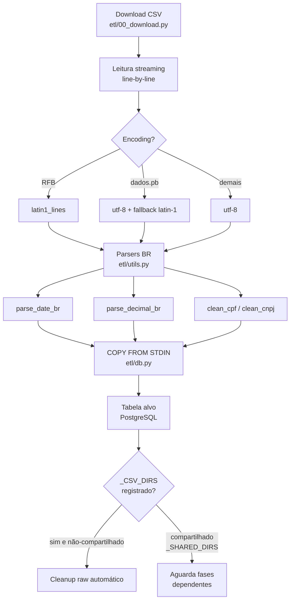

# Guia ETL Clássico — Como adicionar uma fase

Este guia descreve como **adicionar uma nova fase ao ETL clássico** do
`govbr-cruza-dados`. Para o framework **incremental** (append-only com
watermark, DLQ e role-segregação) veja [etl-incremental-guide.md](etl-incremental-guide.md).

## O que é o ETL clássico

O ETL clássico é um pipeline de **full reload**: cada fase tipicamente faz
`TRUNCATE` da(s) sua(s) tabela(s)-alvo e reconstrói tudo a partir dos CSVs
brutos baixados em `$DATA_DIR/<fonte>/`. As 24 fases vivem hardcoded na lista
`phases` de [`etl/run_all.py`](../etl/run_all.py) e são executadas na ordem em
que aparecem — a posição importa porque fases tardias dependem de tabelas,
colunas normalizadas (`cpf_digitos`, `cpf_cnpj_norm`) e índices criados por
fases anteriores. Ver [architecture.md](architecture.md) para o panorama geral
e o lugar do clássico dentro do projeto.

**Quando escolher clássico vs incremental?**

| Escolha clássico se… | Escolha incremental se… |
|---|---|
| Fonte publica snapshot full periódico (ex: RFB CNPJ mensal) | Fonte é append-only com janelas mês/ano (ex: Dados-PB pagamento_YYYY_MM.csv) |
| Não há **natural key** estável | Há NK estável e perdê-la corromperia dados |
| Histórico pode ser regenerado do zero | Preservação histórica é requisito |
| Volume cabe em rebuild noturno | Volume exige carga delta + idempotência |

A regra prática: se você fizer `TRUNCATE` e re-`COPY` for aceitável, é
clássico. Se não, leia o [etl-incremental-guide.md](etl-incremental-guide.md).

Convenções não-negociáveis (sem pandas, streaming, `COPY FROM STDIN`) estão
registradas em [adr/0001-no-pandas.md](adr/0001-no-pandas.md) — leia antes de
mandar PR.

## Fluxo de uma fase ETL clássica



## Anatomia de uma fase

Toda fase é um módulo Python em `etl/NN_<nome>.py` que expõe **uma função
`run() -> None`** — o orquestrador a chama via `importlib`.

```python
# etl/NN_minha_fonte.py
import logging
from etl.config import DATA_DIR
from etl.db import get_conn, copy_csv_streaming, truncate_table
from etl.utils import latin1_lines, parse_date_br, parse_decimal_br, clean_cnpj

log = logging.getLogger(__name__)

def run() -> None:
    with get_conn() as conn:
        truncate_table(conn, "minha_tabela")
        # ... streaming + COPY ...
        conn.commit()
```

### Helpers obrigatórios

**`etl/db.py`** (use sempre — pool gerenciado, retries, COPY tuning):

- `get_conn()` — context manager, devolve conexão do pool.
- `copy_from_stream(conn, table, columns, stream)` — `COPY FROM STDIN` a partir
  de um iterável de linhas TSV.
- `copy_csv_streaming(conn, table, columns, csv_path, ...)` — wrapper para
  arquivos CSV grandes, sem materializar em memória.
- `batch_insert(conn, table, columns, rows)` — fallback para volumes
  pequenos (< 10k linhas).
- `execute_sql_file(conn, "NN_schema.sql")` — executa arquivo de `sql/`.
- `truncate_table(conn, "tabela")` — padrão de início de fase clássica.

**`etl/utils.py`** (parsers BR — reuse, não reimplemente):

- `parse_date_br("31/12/2023")` → `date(2023, 12, 31)`. Aceita também
  `2023-12-31` (ISO) e variantes com timestamp.
- `parse_decimal_br("1.234,56")` → `Decimal("1234.56")`.
- `clean_cpf` / `clean_cnpj` — remove pontuação, valida tamanho.
- `extract_cpf_masked("***123456**")` → 6 dígitos do meio (padrão Portal
  Transparência, ver [glossario.md](glossario.md)).
- `normalize_name` — uppercase, sem acentos, espaços colapsados.
- `latin1_lines(path)` — gerador de linhas para RFB (latin-1 obrigatório, ver
  `RFB_ENCODING` em `etl/config.py`).

### Encoding por fonte

| Fonte | Encoding | Helper |
|---|---|---|
| RFB (Receita Federal) | **latin-1** | `latin1_lines` |
| dados.pb (estadual) | utf-8 com fallback latin-1 | `open(..., encoding="utf-8", errors="replace")` |
| TCE-PB, Portal Transparência, PNCP, demais | utf-8 | `open(..., encoding="utf-8")` |

> **Caveat real:** misturar encodings causa `UnicodeDecodeError` silencioso
> quando rodando dentro de `copy_csv_streaming`. Sempre teste com `head -1` do
> CSV bruto antes de assumir utf-8.

## Passo a passo: adicionar uma fase nova

1. **Criar o módulo** `etl/NN_minha_fonte.py` com `def run() -> None`. Use `NN`
   na posição lógica (depois das deps, antes dos consumidores).

2. **Criar o DDL** em `sql/NN_schema_minha_fonte.sql`. Use `CREATE TABLE IF
   NOT EXISTS` + `CREATE INDEX` separados (não inline em CREATE TABLE — eles
   vão para `sql/11_indices.sql`).

3. **Decidir onde o schema roda:**
   - **Early** — adicionar `execute_sql_file(conn, "NN_schema_minha_fonte.sql")`
     em `etl/01_schema.py`. Padrão para tabelas que outras fases consomem.
   - **Late** — executar o SQL na própria `run()` da fase. Use quando a tabela
     for autocontida.
   Documente a decisão no docstring do módulo.

4. **Registrar na lista `phases`** dentro da função `main()` de `etl/run_all.py:76-101` (lista local hardcoded — a posição
   define a ordem de execução):

   ```python
   ("Fase NN: Minha Fonte", "etl.NN_minha_fonte"),
   ```

5. **Adicionar o download** em `etl/00_download.py` se for fonte externa.
   Use os helpers de download existentes (com retry e progress).

6. **Cleanup de CSV bruto.** Registre em `_CSV_DIRS` (top de `etl/run_all.py`):

   ```python
   _CSV_DIRS = {
       ...
       "etl.NN_minha_fonte": ["minha_fonte"],
   }
   ```

   Se você reutiliza um diretório raw já consumido por outra fase (ex: `rfb/`,
   `tse/`), **adicione também em `_SHARED_DIRS`** — caso contrário a primeira
   fase a terminar deletará os CSVs antes da sua rodar.

7. **Normalização CPF/CNPJ.** Se sua tabela tem coluna CPF/CNPJ, adicione a
   normalização em `etl/15_normalizar.py` (executada na **fase 17**). Essa
   fase cria as colunas `cpf_digitos` (6) e `cpf_cnpj_norm` (14) usadas por
   **todas** as queries cross-source (Q01–Q310). Sem isso, joins viram
   `LIKE/regex` e a query timeouta.

8. **Índices.** Se a tabela alimenta MV (`mv_municipio_pb_risco`,
   `mv_empresa_pb`, etc — ver [architecture.md](architecture.md) layer L1/L2)
   ou queries Q##:
   - Índices gerais → `sql/11_indices.sql`
   - Índices Q##-específicos → `sql/19_indices_queries.sql`

9. **Atualizar contagem** "24 fases" → "25 fases" no `README.md` raiz e em
   `.github/workflows/deploy.yml` (input `etl_phase`).

## Convenções não-negociáveis

Ver [adr/0001-no-pandas.md](adr/0001-no-pandas.md) para o racional completo.

- **Sem pandas.** Box-alvo tem 16GB RAM; DataFrames não cabem em 350M linhas.
  Sempre streaming + `COPY FROM STDIN`.
- **Sem `executemany`** para volumes > 10k linhas — use `COPY`. `batch_insert`
  só para tabelas de domínio (CNAEs, motivos, etc).
- **Sempre `with get_conn() as conn:`** — o pool gerencia conexões; criar
  `psycopg2.connect` direto vaza handles.
- **Logging via `logging` module**, não `print`. Código novo que usa `print`
  será rejeitado em review (ver issue #136).
- **Idempotência explícita.** Declare no docstring qual padrão você usa:
  - `TRUNCATE + rebuild` (padrão clássico), ou
  - `INSERT ... ON CONFLICT DO NOTHING` (raro no clássico, padrão no
    incremental — ver [etl-incremental-guide.md](etl-incremental-guide.md)).

## Exemplo concreto

```python
# etl/NN_minha_fonte.py
"""Carga full-reload da fonte 'Minha Fonte' (CSV anual, latin-1).

Padrão: TRUNCATE + COPY FROM STDIN.
"""
import logging
from etl.config import DATA_DIR
from etl.db import get_conn, copy_from_stream, truncate_table
from etl.utils import latin1_lines, parse_date_br, parse_decimal_br, clean_cnpj

log = logging.getLogger(__name__)

COLUMNS = ["cnpj", "data_emissao", "valor", "descricao"]

def _rows(csv_path):
    for i, line in enumerate(latin1_lines(csv_path)):
        if i == 0:
            continue  # header
        cnpj_raw, data_raw, valor_raw, desc = line.rstrip("\n").split(";")
        yield (
            clean_cnpj(cnpj_raw),
            parse_date_br(data_raw),
            parse_decimal_br(valor_raw),
            desc.strip(),
        )

def run() -> None:
    src_dir = DATA_DIR / "minha_fonte"
    with get_conn() as conn:
        truncate_table(conn, "minha_tabela")
        for csv in sorted(src_dir.glob("*.csv")):
            log.info("Carregando %s", csv.name)
            tsv = (
                "\t".join("" if v is None else str(v) for v in row) + "\n"
                for row in _rows(csv)
            )
            copy_from_stream(conn, "minha_tabela", COLUMNS, tsv)
        conn.commit()
    log.info("Fase concluída")
```

## Caveats conhecidos

- **`_CSV_DIRS` vs `_SHARED_DIRS`.** O cleanup automático em `_cleanup_csvs`
  (`etl/run_all.py:55-68`) deleta o raw após a primeira fase que o consome
  *succeed*. Se sua fase nova consome `rfb/` mas você não adicionou ao
  `_SHARED_DIRS`, a fase 3 (`etl.03_rfb`) deleta o CSV antes da sua rodar.
- **Fase 17 (`etl.15_normalizar`) cria `cpf_digitos`/`cpf_cnpj_norm`** usadas
  por todas as queries cross-source. Esquecer de adicionar sua tabela ali
  quebra joins downstream silenciosamente (query simplesmente retorna 0 linhas
  ao invés de erro).
- **Erros silenciosos em `etl/15_normalizar.py:_exec`** — a função engole
  exceções de `CREATE INDEX`, então uma fase pode "concluir" com índice
  faltando. Sempre verifique `\d+ <tabela>` no psql após mudar normalização.
- **`cnpj_basico` requer EXISTS guard contra `estabelecimento` + extração de `cpf_digitos` via DV check.** Quando o
  documento original (`cpf_cnpj`, `cpfcnpj_credor`, etc) tem 14 caracteres,
  o ETL faz `cnpj_basico = LEFT(doc, 8) WHERE EXISTS estabelecimento`. CPFs
  (11 dígitos) vêm armazenados com padding de zeros à esquerda — `LEFT(..., 8)`
  desses colidiria com `cnpj_basico` de PJ real (PR #151/#153/#156 fix).
  Desde a Fase 5/7 de `etl.15_normalizar` (versão pós-PR feat/etl-cnpj-basico-fix),
  todos os `UPDATE cnpj_basico` validam via `AND EXISTS (SELECT 1 FROM
  estabelecimento WHERE cnpj_completo = doc)`. Fase 9 nova faz cleanup
  retroativo + extrai `cpf_digitos` via DV check matemático (funções
  `is_valid_cpf()`/`is_valid_cnpj()` com módulo 11 oficial RFB). Garantia:
  MEIs/CNPJs reais não-sincronizados (DV CNPJ válido) **nunca** viram
  "CPF sintético" — ficam aguardando RFB sync e ETL idempotente popula
  retroativamente. Veja [`docs/adr/0007`](adr/0007-etl-normalize-fix.md).
- **`run_all` continua após falha de fase.** Cada fase é envolvida em
  try/except — uma falha não aborta o pipeline. Verifique os logs (e o
  resumo `_emit_notice` no GitHub Actions) ao final.

## Como testar localmente

Sem suite automatizada para o ETL clássico (ver seção abaixo). Smoke tests:

```bash
# Sintaxe — sempre rode antes de commit
python -m compileall etl -q

# Fase isolada (sem rodar as 24)
python -m etl.NN_minha_fonte

# Resume a partir da sua fase
python -m etl.run_all NN

# Validar contagem após carga
psql -c "SELECT count(*) FROM minha_tabela"
```

Para testar com subset de dados, coloque manualmente alguns CSVs em
`$DATA_DIR/minha_fonte/` antes de rodar a fase — pule o `etl.00_download`.

## Testes

O ETL clássico **não tem suite automatizada** hoje — fases novas não bloqueiam
por testes. A suite existente (`tests/incremental/`) cobre apenas o framework
incremental. Se você quiser adicionar testes, modele em cima de
`tests/incremental/test_*.py` mas note que rodá-los exige Postgres com
migrations 22–29+32+34+35 + role `etl_incremental`.

A validação real acontece em produção via:
- Contagens de linha por tabela (logged no fim de cada fase)
- Auditoria de identificadores nos relatórios:
  `python scripts/audit_report_identifiers.py`
- Queries Q## em `python -m etl.run_queries` (resultados em `resultados/`)
