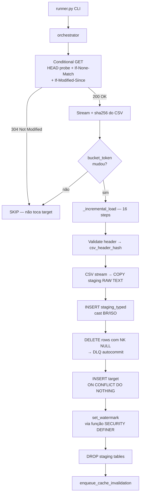

# Guia ETL Incremental — Como adicionar uma spec

Este guia descreve como **adicionar uma nova `LoaderSpec`** ao framework
incremental do `govbr-cruza-dados`. Para o ETL clássico (full reload,
TRUNCATE+rebuild) veja [etl-guide.md](etl-guide.md).

Os detalhes internos do framework (componentes, migrations, fluxo de 16
passos) ficam em [`../etl/incremental/README.md`](../etl/incremental/README.md);
este guia foca em **como adicionar uma fonte nova**.

## Introdução

O framework incremental existe para fontes que:

- Publicam dados em **janelas mês/ano** (ex: `pagamento_2024_03.csv`)
- São **append-only** com correções retroativas eventuais
- Exigem **preservação histórica** (não pode haver `TRUNCATE`)
- Têm uma **natural key estável** (corruptíveis se sobrescritas)

Para fontes que não atendem essas condições — RFB CNPJ snapshot mensal, TSE
prestação de contas anual full — **mantenha clássico**. Ver
[architecture.md](architecture.md) para o panorama e
[etl-guide.md](etl-guide.md) para o fluxo clássico.



## Princípios não-negociáveis (P1–P6)

Citados literalmente de [`../etl/incremental/README.md`](../etl/incremental/README.md):

1. 🔴 **NÃO CORROMPER DADOS EXISTENTES** (sobrepõe tudo)
2. **NÃO-DESTRUTIVO** — sem TRUNCATE/DROP/DELETE em targets
3. **AUDITÁVEL** — rastro completo, imutável pelo ETL role
4. **ERROR RESILIENT** — recuperável de qualquer crash
5. **FAST** — download condicional + idempotency
6. **ZERO TOLERANCE** — watermark nunca avança em failure; DLQ persiste mesmo
   em rollback do `main_conn`

A role `etl_incremental` (criada em `sql/28_etl_role_grants.sql`) tem apenas
`SELECT/INSERT/UPDATE` nos targets — **nunca `DELETE`/`TRUNCATE`/`DROP`**.
Qualquer spec que precise dessas grants viola P2 e deve ser rejeitada em
review.

## Quando NÃO usar incremental

Mantenha clássico se **qualquer** for verdade:

- Fonte é **snapshot full** (RFB CNPJ — substitui o universo todo a cada mês)
- **Não há NK estável** (registros mudam de identidade entre publicações)
- Reconstruir do zero é mais barato que delta
- Dados não são append-only (sobrescrita esperada de linhas históricas)

Caso clássico canônico: **RFB CNPJ** — 60M+ linhas, snapshot mensal, sem NK
preservável → fica em `etl.03_rfb` clássico.

## Passo a passo: adicionar uma spec incremental

### 1. Profilar a natural key em prod (read-only)

Antes de qualquer código, prove que a NK candidata é única:

```sql
-- read-only contra prod
SELECT count(*) FROM (
    SELECT nk1, nk2, nk3
    FROM target_existente
    GROUP BY nk1, nk2, nk3
    HAVING count(*) > 1
) d;
-- deve retornar 0
```

Se você não consegue chegar a 0 com colunas naturais, use
`nk_synthetic_md5=True` na spec (hash determinístico de todas as colunas).
**Não fakeie NK** — corrompe dados (P1).

### 2. Criar/alterar DDL do target

Em `sql/NN_*.sql`, defina a tabela target e o índice único da NK:

```sql
CREATE TABLE IF NOT EXISTS minha_fonte_tabela (
    -- colunas da NK + payload
    exercicio          SMALLINT  NOT NULL,
    codigo_ug          TEXT      NOT NULL,
    numero_doc         TEXT,        -- pode ser NULL → COALESCE no índice
    data_evento        DATE      NOT NULL,
    -- ... payload ...
    inserted_at        TIMESTAMPTZ DEFAULT now()
);

CREATE UNIQUE INDEX CONCURRENTLY IF NOT EXISTS ix_minha_fonte_tabela_nk
    ON minha_fonte_tabela (
        exercicio,
        codigo_ug,
        COALESCE(NULLIF(numero_doc, ''), '__NULL__'),
        data_evento
    );
```

Colunas nullable da NK **devem** entrar via `COALESCE(NULLIF(col, ''), '__NULL__')`
porque Postgres trata `NULL ≠ NULL` em índices únicos — sem isso, dois
registros com `numero_doc IS NULL` viram duplicatas.

### 3. Grants para `etl_incremental`

Em `sql/28_etl_role_grants.sql`:

```sql
GRANT SELECT, INSERT, UPDATE ON minha_fonte_tabela TO etl_incremental;
-- NUNCA: GRANT DELETE / TRUNCATE / DROP   (viola P2)
```

### 4. Criar a `LoaderSpec`

Arquivo: `etl/incremental/specs/<fonte>_<tabela>.py`. Reuse helpers de
`_pb_helpers.py` se for fonte Dados-PB-like. Esqueleto baseado em
`pb_pagamento.py`:

```python
# etl/incremental/specs/minha_fonte_tabela.py
"""LoaderSpec para minha_fonte_tabela.

Source: https://exemplo.gov.br/csv?exercicio=YYYY&mes=MM
Formato: CSV ; quote " encoding latin-1 datas DD/MM/YYYY decimais 1.234,56.
NK: (exercicio, codigo_ug, numero_doc, data_evento)
"""
from __future__ import annotations
import re
from datetime import date
from ..spec import LoaderSpec, CursorStrategy, DedupeStrategy


def _bucket_from_filename(name: str) -> str | None:
    m = re.match(r"^minha_(\d{4})_(\d{2})\.csv$", name, re.IGNORECASE)
    return f"{m.group(1)}-{m.group(2)}" if m else None


def _file_pattern(bucket_id: str) -> list[str]:
    y, m = bucket_id.split("-")
    return [f"minha_{y}_{m}.csv"]


def _url_for_bucket(bucket_id: str) -> list[tuple[str, str]]:
    y, m = bucket_id.split("-")
    url = f"https://exemplo.gov.br/csv?exercicio={y}&mes={int(m)}"
    return [(url, f"minha_{y}_{m}.csv")]


def _enumerate_buckets() -> list[str]:
    today = date.today()
    out = []
    for year in range(2018, today.year + 1):
        last = today.month if year == today.year else 12
        for month in range(1, last + 1):
            out.append(f"{year}-{month:02d}")
    return out


COLUMNS = ["EXERCICIO", "CODIGO_UG", "NUMERO_DOC", "DATA_EVENTO", "VALOR"]
COLUMN_RENAMES = {c: c.lower() for c in COLUMNS}
COLUMN_TYPES = {c: "TEXT" for c in COLUMNS}
COLUMN_TYPES["EXERCICIO"]   = "SMALLINT"
COLUMN_TYPES["DATA_EVENTO"] = "DATE"
COLUMN_TYPES["VALOR"]       = "NUMERIC"


SPEC = LoaderSpec(
    source="minha_fonte",
    table="minha_fonte_tabela",
    natural_key=["EXERCICIO", "CODIGO_UG", "NUMERO_DOC", "DATA_EVENTO"],
    cursor_strategy=CursorStrategy.MONTH_WINDOW,
    dedupe_strategy=DedupeStrategy.UPSERT_DO_NOTHING,
    columns=COLUMNS,
    column_types=COLUMN_TYPES,
    column_renames=COLUMN_RENAMES,
    nk_coalesce_cols=("numero_doc",),  # cols nullable da NK
    csv_delimiter=";",
    csv_quotechar='"',
    watermark_col="DATA_EVENTO",
    watermark_type="string",
    encoding="latin-1",
    encoding_fallback="utf-8-sig",
    decimal_format="br",     # 1.234,56  (use "point" para 1234.56)
    date_format="br",        # DD/MM/YYYY (use "iso" para 2024-01-31)
    refetch_recent_buckets=2,  # ultimo + penultimo (publicação retroativa)
    file_pattern=_file_pattern,
    bucket_from_filename=_bucket_from_filename,
    url_for_bucket=_url_for_bucket,
    enumerate_buckets=_enumerate_buckets,
)
```

### 5. Registrar no runner

Em `etl/incremental/runner.py`, função `_load_all_specs()`. O registro é
**manual hoje** — auto-descoberta via `pkgutil.iter_modules` está prevista na
seção "Próximas iterações" do
[`../etl/incremental/README.md`](../etl/incremental/README.md).

```python
from .specs.minha_fonte_tabela import SPEC as SPEC_MINHA
# ...
def _load_all_specs():
    return [..., SPEC_MINHA]
```

### 6. Bootstrap inicial do watermark

Antes do **primeiro INSERT real**, capture o estado-base do target (mesmo que
vazio):

```bash
python -m etl.incremental.bootstrap_watermark \
    --source minha_fonte --table minha_fonte_tabela
```

Isso grava `bootstrap_target_max`, `bootstrap_target_count` e
`target_schema_hash` em `etl_watermark`. Esses campos são **imutáveis** após o
primeiro INSERT (um trigger garante isso). Para re-baseline (ex: drift de
schema), use `--force` — exige `approver` no log.

### 7. Testar local

A suite cobre o framework completo:

```bash
# Postgres local com migrations 22-29 + 32 + 34 + 35 aplicadas
# + role etl_incremental criada
pytest tests/incremental

# Rodar apenas sua spec
python -m etl.incremental.runner --only "minha_fonte.minha_fonte_tabela"

# Status
psql -c "SELECT * FROM v_etl_status WHERE table_name='minha_fonte_tabela'"
psql -c "SELECT * FROM v_etl_dlq_summary WHERE source='minha_fonte'"
```

### 8. Debug: schema drift e DLQ inflando

**Schema drift** (CSV ganhou colunas, target precisa evoluir):

```bash
# Após ALTER TABLE do target, re-baseline:
python -m etl.incremental.bootstrap_watermark \
    --source minha_fonte --table minha_fonte_tabela \
    --force
```

**DLQ inflando** (linhas rejeitadas acumulando):

```sql
SELECT raw_line, reason, rejected_at
FROM etl_rejected_rows
WHERE source='minha_fonte'
ORDER BY rejected_at DESC
LIMIT 50;
```

Causas típicas:
- **`coerce` incompleto** — adicionar regex/sentinel em
  `default_null_sentinels` da spec.
- **Encoding errado** — ajustar `encoding_fallback`.
- **NK realmente faltante** — não invente, profile de novo (passo 1).

## Observabilidade

Três views consolidam o estado do framework (todas em `sql/29_etl_views.sql`):

| View | Propósito |
|---|---|
| `v_etl_status` | Watermark atual + último bucket processado por tabela |
| `v_etl_dlq_summary` | Contagem agregada de rejeições por source/reason |
| `v_etl_run_summary` | Histórico de runs (sucesso/falha, duração, linhas) |

Cache invalidation no `web_cache` é disparado via
`enqueue_cache_invalidation` ao final de cada bucket bem-sucedido.

## Convenções nominais

- **Staging tables** seguem o padrão D12: `_stg_<src>_<tbl>_<run8>_<seq>_<kind>`
  onde `<run8>` = primeiros 8 chars do `run_id`, `<seq>` = sequencial por
  bucket, `<kind>` ∈ {`raw`, `typed`}. Tudo é dropado ao fim do bucket.
- **`bucket_token`** = `uuid5(namespace=spec, name=sha256_csv)` — determinístico,
  permite skip idempotente.
- **`sha256`** do CSV é guardado em `etl_watermark.metadata` para auditoria e
  comparação cross-run.

## Exemplo concreto

A spec mais simples e bem-comportada do projeto é
[`etl/incremental/specs/pb_pagamento.py`](../etl/incremental/specs/pb_pagamento.py)
(88 linhas). Copie-a como ponto de partida — ela ilustra todos os elementos
do framework: bucket month-window, conditional refetch (`refetch_recent_buckets=2`
para correções retroativas), NK com coluna nullable, encoding latin-1 com
fallback, `DedupeStrategy.UPSERT_DO_NOTHING`.

## Caveats conhecidos

- **`pb_contrato 2022/2023 partial`** — CSVs com errors documentados no
  README do framework. Não invente fix sem profilar a DLQ primeiro
  (`v_etl_dlq_summary` filtrado por `source='dados_pb', table='pb_contrato'`).
- **`enumerate_buckets` hardcoded `range(2018, today.year+1)`** em todas as
  specs PB. Para uma fonte com início histórico diferente, copie o helper e
  ajuste — não tem parametrização hoje.
- **Heartbeat thread + watchdog ainda não cobertos por testes** em
  isolamento. Issue [#135] cobre o smoke test pendente. Em prod, watchdog
  mata bucket que excede `bucket_timeout_sec`.
- **`refetch_recent_buckets`** força re-download dos N últimos buckets mesmo
  com 304 — é o mecanismo de pegar correções retroativas. Default 0; use 2
  para fontes que publicam ajustes do mês anterior.

## Próximas fontes candidatas

Da auditoria do projeto, ordenadas por payoff:

1. **CEIS / CNEP** (sanções administrativas — ver [glossario.md](glossario.md)).
   Alto valor para cruzamentos de fraude, NK clara `(CNPJ, data_inicio_sancao,
   orgao_sancionador)`. Append-only.
2. **SIAPE / Bolsa Família** — publicação mensal, idempotência crítica
   (rebuild full = horas de ETL). NK estável (matrícula+mês).
3. **PNCP** — maior payoff, mas exige novo `CursorStrategy=API_CURSOR` (API
   paginada, não janela de arquivo). Trabalho de framework, não só spec.
