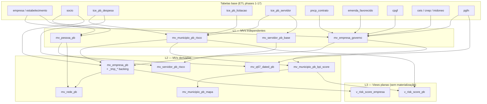

# MV guide — adicionando uma materialized view

Este guia cobre o trabalho prático em [`sql/12_views.sql`](../sql/12_views.sql) (1500+ linhas). Para overview das camadas, ver [architecture.md](architecture.md). Para queries que consomem MVs, ver [queries-guide.md](queries-guide.md).

## Camadas

As MVs são organizadas em **três camadas** com dependências estritas:



> **L2 silenciosamente quebra** se uma MV L1 mudar de coluna sem propagar. A fase 18 ([`etl/21_views.py`](../etl/21_views.py)) executa o arquivo inteiro em ordem — um CREATE quebrado aborta o resto.

## Convenções do `sql/12_views.sql`

1. **DROP no topo** em ordem reversa de dependência (views planas → L2 → L1).
2. **CREATE por camadas** depois dos DROPs (L1 primeiro, depois L2, depois views).
3. `REFRESH MATERIALIZED VIEW CONCURRENTLY` exige `UNIQUE INDEX` na MV. Sem isso, falha em runtime.
4. **Notas de refresh** no rodapé do arquivo (linhas 1465+) — lista a ordem operacional dos REFRESH em produção.

Exemplo real do topo do arquivo:

```sql
-- Drop em ordem reversa de dependência
DROP VIEW IF EXISTS v_risk_score_pb CASCADE;
DROP VIEW IF EXISTS v_risk_score_empresa CASCADE;
DROP MATERIALIZED VIEW IF EXISTS mv_rede_pb CASCADE;
DROP MATERIALIZED VIEW IF EXISTS mv_empresa_pb CASCADE;
DROP MATERIALIZED VIEW IF EXISTS mv_servidor_pb_risco CASCADE;
DROP MATERIALIZED VIEW IF EXISTS mv_servidor_pb_base CASCADE;
-- ... (L1 por último)
DROP MATERIALIZED VIEW IF EXISTS mv_empresa_governo CASCADE;
```

## Adicionando uma MV nova — checklist

1. **Decida a camada** olhando as deps (L1 se só toca tabelas base; L2 se lê outra MV; view plana se for projeção barata).
2. **Adicione `DROP MATERIALIZED VIEW IF EXISTS <nome> CASCADE`** no bloco de DROPs, **respeitando a ordem reversa** (mais derivada primeiro).
3. **Escreva o `CREATE MATERIALIZED VIEW`** na seção correspondente (L1 / L2 / Views).
4. **Crie `UNIQUE INDEX`** logo após o CREATE se quiser permitir `REFRESH ... CONCURRENTLY`:
   ```sql
   CREATE UNIQUE INDEX mv_minha_nova_pk
       ON mv_minha_nova (cnpj_basico, municipio);
   ```
5. **Índices auxiliares** para joins/filtros frequentes (não-unique).
6. **Atualize o bloco de refresh notes** no rodapé do arquivo (~linha 1465) adicionando a linha:
   ```sql
   --   REFRESH MATERIALIZED VIEW CONCURRENTLY mv_minha_nova;
   ```
7. **Atualize consumidores** em [`web/queries/registry.py`](../web/queries/registry.py) e em `queries/*.sql` que dependerem da MV nova.
8. **Verifique `etl/21_views.py`** — ele executa `sql/12_views.sql` inteiro; nenhuma mudança Python é necessária a menos que você adicione uma _tmp table backing (ver abaixo).
9. **Atualize o diagrama** neste doc + o diagrama de MVs em [architecture.md](architecture.md).

## Performance: REFRESH CONCURRENTLY vs plain

| Modo | Lock | Tempo | Quando usar |
|---|---|---|---|
| `REFRESH ... CONCURRENTLY` | `ShareUpdateExclusive` (não bloqueia leitura) | ~2× (escreve nova cópia + reindex) | Padrão em prod — UI continua servindo |
| `REFRESH ...` (plain) | `AccessExclusive` (bloqueia tudo) | ~1× | Bootstrap inicial; mudança de schema |

`CONCURRENTLY` exige UNIQUE INDEX. Sem ele, escolha está feita: você só pode dar refresh plain (com downtime de leitura).

## Tabelas `_tmp_*` backing

Quando uma MV agrega muitas fontes e o SELECT inicial dá timeout, o padrão é usar tabelas auxiliares **`_tmp_<algo>`** povoadas antes do CREATE da MV. Exemplo em `mv_empresa_pb` (linhas ~664+). Caveat citado no próprio arquivo:

```sql
-- Na próxima execução, o CASCADE no DROP MATERIALIZED VIEW libera as _tmp tables,
-- mas elas precisam ser recriadas/povoadas antes do CREATE MATERIALIZED VIEW.
```

Se adicionar uma _tmp backing, documente no comentário acima do CREATE quem a popula (geralmente uma função em `etl/21_views.py` antes de chamar o `execute_sql_file`).

## Caveats

- **Tamanho do arquivo:** 1500+ linhas. Qualquer mudança exige ler a ordem inteira de DROP/CREATE antes de inserir. Use grep para localizar:
  ```bash
  grep -n 'MATERIALIZED VIEW\|CREATE OR REPLACE VIEW' sql/12_views.sql
  ```
- **Drift Python ↔ SQL:** [`web/kpis/municipio_pb.py:sql_score_expression()`](../web/kpis/municipio_pb.py) define a expressão de score em Python, mas `mv_municipio_pb_risco` materializa essa mesma lógica em SQL inline. Mudanças precisam ser feitas **nos dois lugares** — `TODO.md` registra o drift como dívida técnica.
- **L2 perde dep silenciosamente:** se você renomear coluna em L1 e esquecer L2, fase 18 falha tarde no pipeline. Rode `python -m etl.run_all 18` localmente após qualquer mudança em MV.
- **`REFRESH CONCURRENTLY` precisa de espaço em disco** equivalente ao tamanho da MV (escreve cópia inteira antes de swap). Em VMs com disk-pressure, plain refresh pode ser preferível.
- **CASCADE** nos DROPs propaga para views planas e índices — saudável, mas exige recriação completa.

## Relacionados

- [architecture.md](architecture.md) — diagrama macro das camadas + ERD.
- [cache.md](cache.md) — `web_cache` lê queries que dependem de MVs; mudança de MV requer rewarm para evitar cache stale.
- [queries-guide.md](queries-guide.md) — quando uma Q## lenta deve virar MV.
- [`etl/21_views.py`](../etl/21_views.py) — phase 18 que aplica `sql/12_views.sql`.
