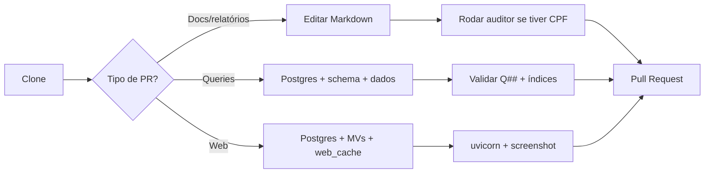

# Onboarding: do clone ao `uvicorn` em uma tarde

Este guia é para uma pessoa contribuindo casualmente  alguém como Marina, que
quer entender o projeto, fazer uma melhoria pequena e talvez rodar parte do
frontend localmente. O objetivo é ser honesto: documentação e relatórios são
simples de editar; queries e web dependem de PostgreSQL com schema e dados.

## TL;DR

```bash
git clone https://github.com/lucasdiniz/govbr-cruza-dados
cd govbr-cruza-dados
pip install -e .[web,dev] && npm ci
```

Para abrir o frontend:

```bash
python -m uvicorn web.main:app --port 8000
```

Mas atenção: o `uvicorn` sobe a aplicação, porém rotas reais como
`/cidade/joao-pessoa` exigem **schema PostgreSQL + materialized views +
`web_cache` populado**. Enquanto não houver sample data oficial, rodar o portal
completo localmente é trabalhoso.

## Pré-requisitos

- Python **3.10+**  testado principalmente com 3.11 e 3.12.
- Node.js **20+**.
- PostgreSQL **16** para caminhos de queries/web.
- Aproximadamente **5 GB livres** para setup mínimo sem ETL real.
- **8 GB RAM** mínimos para desenvolvimento leve; o ETL completo usa muito mais
  disco e tempo.
- Git e um editor de texto.

## Escolha seu caminho

O projeto aceita três tipos de contribuição, em complexidade crescente.

| Caminho | Para quê | Precisa Postgres? | Bom primeiro PR? |
|---|---|---:|---:|
| A. Documentação/relatórios | `README.md`, `docs/`, `relatorios/` | Não | Sim |
| B. Queries Q## | `queries/*.sql`, MVs, índices, registry web | Sim, com schema e dados/subset | Médio |
| C. Web frontend | `web/`, templates, cache, UX | Sim, com MVs e `web_cache` | Difícil sem dump |

### A. Documentação e relatórios

Este é o caminho recomendado para começar. Você consegue clonar o repositório,
editar markdown, rodar o auditor de CPFs e abrir PR sem banco local.

Use este caminho para:

- corrigir typos;
- melhorar explicações em `docs/`;
- atualizar glossário;
- escrever ou revisar relatórios em `relatorios/`;
- melhorar exemplos de comandos.

### B. Queries Q##

Queries investigativas vivem em `queries/*.sql` e são identificadas por headers
`-- Q##: Título`. Elas podem ser expostas no frontend via
`web/queries/registry.py`.

Você precisa de PostgreSQL com schema e dados relevantes. Não precisa ter todos
os ~350M registros se a query usa um subset, mas precisa de tabelas suficientes
para validar resultado, performance e índices.

Hoje ainda não existe um dump público pequeno de sample data. Se a issue exigir
dados, peça um snapshot reduzido nos comentários ou por contato.

### C. Web frontend

O frontend é FastAPI + Jinja2, sem ORM. Muitas rotas leem `web_cache` em vez de
executar SQL pesado durante o request. Por isso, só subir `uvicorn` não basta
para testar a experiência completa.

Para PRs em `web/`, inclua no PR:

- rota testada manualmente;
- screenshot ou gravação curta;
- estado do cache usado;
- limitações do teste local, se rodou sem dados completos.

## Setup detalhado  caminho A (5 min)

### 1. Clone

```bash
git clone https://github.com/lucasdiniz/govbr-cruza-dados
cd govbr-cruza-dados
```

### 2. Edite markdown

Arquivos bons para primeira contribuição:

```bash
# exemplos de alvos comuns
$EDITOR README.md
$EDITOR CONTRIBUTING.md
$EDITOR docs/glossario.md
$EDITOR relatorios/algum_relatorio.md
```

### 3. Se mexer em CPFs, rode o auditor

Relatórios não devem conter CPF completo formatado. O padrão público é
`***.NNN.NNN-**`.

```bash
python scripts/audit_report_identifiers.py --strict
```

O modo `--strict` é offline: ele não precisa de banco. Ele falha se encontrar CPF
completo no formato `NNN.NNN.NNN-NN` em markdown versionado.

### 4. Commit

Use uma mensagem curta. Se o commit foi produzido com auxílio do Copilot, inclua
o trailer exigido pelo projeto:

```bash
git checkout -b docs/minha-melhoria
git add docs/glossario.md
git commit -m "docs: melhora explicação de empenho" \
  -m "Co-authored-by: Copilot <223556219+Copilot@users.noreply.github.com>"
```

### 5. Push + PR

```bash
git push origin docs/minha-melhoria
```

Abra PR a partir do seu fork. Explique o motivo da mudança e cite se rodou o
auditor.

## Setup detalhado  caminhos B/C (45 min, sem contar dados)

### 1. Instale PostgreSQL 16

macOS/Homebrew:

```bash
brew install postgresql@16
brew services start postgresql@16
```

Ubuntu/Debian:

```bash
sudo apt update
sudo apt install postgresql-16 postgresql-client-16
```

Windows: use o instalador oficial do PostgreSQL 16 e garanta que `psql` esteja
no `PATH`.

### 2. Instale dependências Python

```bash
pip install -e .[web,dev]
```

### 3. Configure ambiente

```bash
cp .env.example .env
```

Edite `.env` com suas credenciais locais. O padrão esperado no README é algo
como `localhost:5432/govbr` com usuário `govbr`.

Crie usuário e banco, se ainda não existirem:

```bash
sudo -u postgres psql -c "CREATE USER govbr WITH PASSWORD 'govbr_dev';"
sudo -u postgres psql -c "CREATE DATABASE govbr OWNER govbr;"
```

No Windows, execute comandos equivalentes no SQL Shell ou em um terminal com
`psql` autenticado como administrador.

### 4. Habilite extensões obrigatórias

```bash
psql -d govbr -c "CREATE EXTENSION IF NOT EXISTS pg_trgm; CREATE EXTENSION IF NOT EXISTS unaccent;"
```

### 5. Instale dependências Node

```bash
npm ci
```

### 6. Compile assets quando mexer no frontend

```bash
npm run build
```

### 7. Gap atual: schema vazio e sample data

Aqui está o ponto mais importante: sem sample data, o banco local estará vazio.
O projeto ainda não tem um caminho oficial schema-only + dados mínimos de 1
município. Quando existir, ele deve ser documentado em `docs/sample-data.md`.

Enquanto isso, opções reais são:

1. rodar fases específicas do ETL para as fontes que sua query usa;
2. rodar o ETL completo, se você tiver tempo, disco e rede;
3. pedir um dump reduzido na issue ou por
   [`contato@transparenciapb.org`](mailto:contato@transparenciapb.org).

Comandos úteis:

```bash
python -m etl.run_all          # ETL completo: pesado
python -m etl.run_all 4        # retoma de uma fase 1-based
python -m etl.run_queries --query Q03
python -m web.warm_cache --pb  # popula web_cache para municípios PB
```

### 8. Suba o frontend

```bash
python -m uvicorn web.main:app --port 8000
```

Em outro terminal:

```bash
curl http://localhost:8000/
curl -i http://localhost:8000/cidade/joao-pessoa
```

Resultado esperado:

- `/` deve retornar HTML se a aplicação subiu;
- `/cidade/joao-pessoa` deve retornar 200 apenas se cache/MVs estiverem
  populados;
- rotas cache-only podem retornar **503** em cache miss, o que é esperado em
  banco vazio.

## Fluxo mental do projeto



## O que abrir para entender o código

Leia nesta ordem:

1. [`README.md`](../README.md)  visão geral, comandos e variáveis de ambiente.
2. [`CONTRIBUTING.md`](../CONTRIBUTING.md)  tipos de contribuição e convenções.
3. [`docs/architecture.md`](architecture.md)  arquitetura do ETL, MVs, cache e
   deploy.
4. [`docs/glossario.md`](glossario.md)  termos de domínio público brasileiro.
5. [`../etl/incremental/README.md`](../etl/incremental/README.md)  framework
   incremental, se você for mexer em ETL.

Depois, navegue pelo código conforme o alvo:

| Área | Arquivos principais |
|---|---|
| ETL clássico | `etl/run_all.py`, `etl/00_download.py`, `etl/db.py` |
| Normalização CPF/CNPJ | `etl/15_normalizar.py`, `etl/utils.py` |
| SQL schema/MVs | `sql/*.sql`, especialmente `sql/12_views.sql` |
| Queries | `queries/*.sql`, `etl/run_queries.py` |
| Web | `web/main.py`, `web/routes/`, `web/templates/` |
| Cache | `web/warm_cache.py`, `web/queries/registry.py` |

## Validação rápida antes do PR

Para docs/relatórios:

```bash
python scripts/audit_report_identifiers.py --strict
```

Para Python editado:

```bash
python -m compileall etl web scripts -q
```

Para frontend/assets:

```bash
npm run build
```

Para queries:

```bash
python -m etl.run_queries --query Q03
```

Troque `Q03` pela sua query. Em queries que serão expostas no web, valide também
índices e tempo de execução; o timeout default no registry é curto.

## Onde pedir ajuda

- GitHub Discussions  canal planejado para perguntas abertas.
- Issues com label `question`.
- Issues com label `good first issue`  há uma fila de primeiras tarefas, como
  #126#141.
- E-mail: [`contato@transparenciapb.org`](mailto:contato@transparenciapb.org).

Ao pedir ajuda, inclua:

- sistema operacional;
- versão de Python, Node e PostgreSQL;
- comando executado;
- erro completo;
- se você tem ou não dados carregados.

## Primeira contribuição sugerida

Se você quer começar hoje:

1. escolha uma issue `good first issue`;
2. prefira uma mudança em `docs/` ou `relatorios/`;
3. rode o auditor se tocar em identificadores pessoais;
4. abra PR pequeno, com contexto claro.

PR pequeno e bem explicado costuma ser melhor que PR grande tentando resolver
vários problemas de uma vez.

## Caveats conhecidos

- `psycopg2-binary` pode falhar em combinações recentes como Python 3.13 ou ARM
  Linux; o projeto declara Python 3.10+ e é testado principalmente em 3.11/3.12.
- `pyproject.toml` ainda não tem lockfile Python; versões transitivas podem
  variar entre máquinas.
- O frontend depende de materialized views e `web_cache`; rotas cache-only
  retornam 503 sem cache populado.
- Não há sample data público ainda; contribuições B/C podem depender de apoio do
  owner.
- A instalação local padrão usa PostgreSQL nativo. Docker pode funcionar para o
  banco, mas não é o caminho operacional de produção.
- O ETL completo é pesado: baixar e processar todas as fontes não é requisito
  para contribuir com documentação.

## Checklist de PR

Antes de abrir:

- [ ] A mudança está pequena e focada.
- [ ] Links relativos funcionam.
- [ ] Exemplos de comando usam blocos `bash`.
- [ ] CPFs em markdown estão mascarados.
- [ ] Rodei `python scripts/audit_report_identifiers.py --strict` se toquei em
      relatórios ou dados pessoais.
- [ ] Para `web/`, anexei screenshot e expliquei o estado do cache.
- [ ] Para `queries/`, indiquei como validei resultado e performance.
