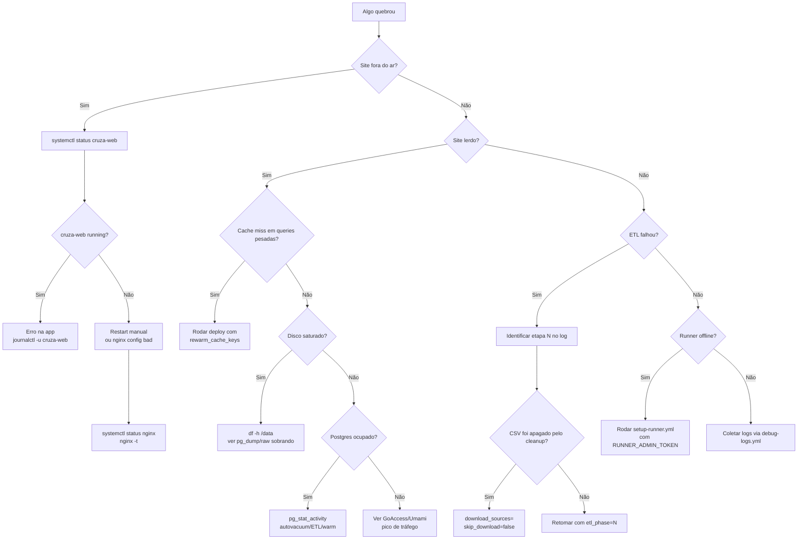

# Operação e runbooks

Runbooks operacionais para produção do `govbr-cruza-dados` / [transparenciapb.org](https://transparenciapb.org). Cada seção é independente: identifique o sintoma, execute o menor procedimento seguro e registre o que foi feito no PR/issue operacional.

Para entender o pipeline, veja [`deploy.md`](deploy.md). Para visão geral de arquitetura, veja [`architecture.md`](architecture.md).

## Decision tree: algo quebrou, o que faço?



## Acesso rápido à VM

Com SSH disponível:

```bash
ssh govbr@transparenciapb.org
sudo systemctl status cruza-web --no-pager
sudo journalctl -u cruza-web -n 200 --no-pager
```

Se SSH estiver bloqueado por fail2ban ou indisponível, use o workflow [`../.github/workflows/debug-logs.yml`](../.github/workflows/debug-logs.yml) para puxar `journalctl` via automação.

## Runbook: rollback de deploy

Objetivo: voltar a VM para um commit anterior conhecido bom e reiniciar serviços sem reconstruir banco.

1. Identifique o último deploy bom:

```bash
gh run list --workflow "Deploy to Azure VM" --limit 10
# ou veja o histórico da branch main / PR que introduziu a falha
git log --oneline -20
```

2. Entre na VM e faça rollback do código:

```bash
ssh govbr@transparenciapb.org
cd /home/govbr/govbr-project
git fetch origin main --tags
git status --short
git reset --hard <COMMIT_BOM>
source venv/bin/activate
pip install -e ".[web]" -q
npm ci --no-audit --no-fund
node scripts/build-assets.mjs
```

3. Reinicie serviços web:

```bash
sudo systemctl daemon-reload
sudo systemctl restart cruza-web
sudo systemctl status cruza-web --no-pager --lines=30
curl -I -H "Host: transparenciapb.org" http://127.0.0.1:8000/
```

4. Se a falha estava em cache de query, prefira não truncar tudo. Rode um deploy `etl_phase=web` com `rewarm_cache_keys=<QID>` para regenerar zero-downtime.

5. Depois abra PR revertendo/fixando a alteração em `main`. O próximo deploy normal sobrescreverá o rollback manual com `origin/main`.

## Runbook: restore zero (DB perdido)

### Com backup disponível

1. Pare web/warm para evitar leituras inconsistentes:

```bash
sudo systemctl stop cruza-web
sudo systemctl stop cruza-warm-cache || true
```

2. Restaure o dump mais recente. Exemplo com formato custom do `pg_dump -Fc`:

```bash
createdb -U govbr govbr_restore
PGPASSWORD="$POSTGRES_PASSWORD" pg_restore \
  -U govbr \
  -d govbr_restore \
  --clean --if-exists --no-owner \
  /data/backups/govbr-latest.dump
```

3. Faça smoke mínimo:

```bash
PGPASSWORD="$POSTGRES_PASSWORD" psql -U govbr -d govbr_restore -c "SELECT COUNT(*) FROM empresa;"
PGPASSWORD="$POSTGRES_PASSWORD" psql -U govbr -d govbr_restore -c "SELECT COUNT(*) FROM web_cache;"
```

4. Promova o banco restaurado conforme estratégia local (renomear databases ou restaurar diretamente sobre `govbr` em janela de manutenção). Depois:

```bash
sudo systemctl start cruza-web
sudo systemctl status cruza-web --no-pager
```

### Sem backup disponível

Faça reload completo pelo workflow:

```yaml
etl_phase: all
clean: true
skip_download: false
warm_cache: true
```

Expectativa: ~24h ou mais, dependendo de fontes remotas, download, ETL, MVs e warm. O site pode ficar parcial/fora do ar até cache e MVs terminarem.

## Runbook: runner self-hosted desconectou

Sintomas: workflow fica em fila aguardando runner `self-hosted`, runner offline no GitHub, ou serviço `actions-runner` parado.

1. Tente validar na VM:

```bash
sudo systemctl status actions-runner* --no-pager
sudo journalctl -u 'actions-runner*' -n 200 --no-pager
```

2. Se token expirou ou runner foi removido, rode [`../.github/workflows/setup-runner.yml`](../.github/workflows/setup-runner.yml) com `RUNNER_ADMIN_TOKEN` configurado.

3. Após setup, confirme:

```bash
sudo systemctl daemon-reload
sudo systemctl status actions-runner* --no-pager
```

4. Reexecute o deploy. O `preflight` liga/redimensiona a VM antes de o job self-hosted precisar iniciar.

## Runbook: troubleshoot `warm_cache`

O step `Warm cache` roda `cruza-warm-cache.service` como oneshot e falha quando mais de 5% das queries quebram. O workflow usa `continue-on-error`, então pode haver deploy com warning e postflight ainda reduzir a VM.

1. Ver logs:

```bash
sudo journalctl -u cruza-warm-cache -n 500 --no-pager
sudo systemctl status cruza-warm-cache --no-pager --lines=50
```

2. Identifique `query_id`, município/cache key e stack trace.

3. Se é bug em SQL/registry, corrija e rode:

```yaml
etl_phase: web
rewarm_cache_keys: <QID ou chave base>
```

4. Se é schema/MV stale, rode:

```yaml
etl_phase: sql
warm_cache: true
```

5. Se live cache está quebrado e precisa remover imediatamente, use `invalidate_cache_keys=<QID>` sabendo que causa cache miss até rewarm.

## Runbook: backup DB

**Status atual: pendente.** Não há estratégia documentada de backup/restore validada em produção. Este é um gap operacional A4.

Sugestões a formalizar:

### Opção A  `pg_dump` para Azure Blob

```bash
mkdir -p /data/backups
pg_dump -U govbr -Fc -d govbr -f /data/backups/govbr-$(date +%F).dump
az storage blob upload \
  --account-name <storage> \
  --container-name backups \
  --file /data/backups/govbr-$(date +%F).dump \
  --name govbr-$(date +%F).dump
```

Pontos de atenção: dump de banco grande pode demorar muitas horas e competir com ETL/warm; rode em B4/Premium e monitore `/data`.

### Opção B  snapshot Azure Disk

Snapshot do data disk é mais rápido para disaster recovery, mas exige consistência. Idealmente pare PostgreSQL ou use mecanismo coordenado:

```bash
sudo systemctl stop postgresql
az snapshot create \
  --resource-group <rg> \
  --source <disk-id> \
  --name govbr-data-$(date +%F)
sudo systemctl start postgresql
```

A estratégia final deve definir retenção, criptografia, teste periódico de restore e custo.

## Runbook: fail2ban management

Jails customizadas em `deploy/`:

- `transparenciapb-429`  muitos HTTP 429/rate limit.
- `transparenciapb-exploit-paths`  scanners tentando `/.env`, `/.git`, `/wp-admin`, etc.
- `recidive`  reincidência.

Comandos:

```bash
sudo fail2ban-client status
sudo fail2ban-client status transparenciapb-429
sudo fail2ban-client status transparenciapb-exploit-paths
sudo fail2ban-client status recidive

# Unban manual
sudo fail2ban-client set transparenciapb-429 unbanip <IP>
sudo fail2ban-client set transparenciapb-exploit-paths unbanip <IP>
sudo fail2ban-client set recidive unbanip <IP>
```

Se você bloqueou o próprio SSH, use `debug-logs.yml` e/ou console Azure para recuperar acesso.

## Runbook: logs ad-hoc

Workflow [`../.github/workflows/debug-logs.yml`](../.github/workflows/debug-logs.yml) coleta logs da VM sem depender de sessão SSH interativa. Use quando:

- SSH está bloqueado por fail2ban.
- Precisa anexar logs a issue/PR.
- Quer logs de `cruza-web`, `cruza-warm-cache`, `nginx`, `postgresql`, `goaccess` ou runner.

Na VM, comandos equivalentes:

```bash
sudo journalctl -u cruza-web -n 300 --no-pager
sudo journalctl -u cruza-warm-cache -n 300 --no-pager
sudo journalctl -u nginx -n 200 --no-pager
sudo journalctl -u postgresql -n 200 --no-pager
sudo tail -n 200 /var/log/nginx/access.log
sudo tail -n 200 /var/log/nginx/error.log
```

## Runbook: GoAccess / Umami

Painéis admin ficam atrás de basic-auth em:

- `https://transparenciapb.org/_traffic/goaccess/`
- `https://transparenciapb.org/_traffic/analytics/`

GoAccess usa basic-auth configurado por `deploy/setup-goaccess.sh` e secret `GOACCESS_PASSWORD`. Umami ainda exige login próprio no app.

Trocar senha basic-auth:

```bash
sudo apt-get install -y apache2-utils
sudo htpasswd -c /etc/nginx/.htpasswd-traffic <usuario>
sudo nginx -t
sudo systemctl reload nginx
```

Nota de hardening: há memória operacional de que a senha atual foi admitida como fraca pelo owner; trate troca/rotação como issue de segurança operacional.

## Runbook: disco cheio

1. Verifique uso:

```bash
df -h / /data
sudo du -h --max-depth=1 /data | sort -h
```

2. O cleanup raw deveria remover CSVs após cada fase. Se sobraram diretórios de fonte e **não há ETL rodando**, remova com cuidado:

```bash
sudo systemctl status cruza-warm-cache --no-pager
ps aux | grep -E 'etl\.run_all|etl\.00_download|incremental.runner' | grep -v grep
rm -rf /data/<fonte>
```

3. Procure dumps/logs grandes:

```bash
find /data -maxdepth 3 -type f -size +5G -print
sudo journalctl --disk-usage
```

4. Se PostgreSQL cresceu, não delete arquivos em `/data/postgresql` manualmente. Investigue tabelas grandes e autovacuum.

## Runbook: PostgreSQL autotune

`pg-autotune.service` recalcula `shared_buffers`, `effective_cache_size`, `work_mem` e `maintenance_work_mem` conforme RAM atual da VM. O deploy instala o unit e o drop-in `pg-autotune-pg-dropin.conf`; quando VM sobe B2/B4, Postgres recebe tuning coerente.

Validar:

```bash
sudo systemctl status pg-autotune --no-pager
sudo journalctl -u pg-autotune -n 100 --no-pager
sudo cat /etc/postgresql/16/main/conf.d/tuning.conf
systemctl cat postgresql@16-main.service | grep -A5 -B5 pg-autotune
```

Aplicar manualmente:

```bash
sudo /usr/local/bin/pg-autotune.sh
sudo systemctl restart postgresql
```

## Runbook: VM size lock / disco preso em Premium

Azure limita mudanças de SKU de disco a 2 por 24h. O workflow trata conversão de disco como best-effort; se falhar, a VM pode voltar para B2 mas o disco ficar em Premium por algumas horas, custando ~US$0,05/h extra.

O que fazer:

1. Não force loops de deploy só para converter disco; isso pode consumir mais limite.
2. Espere 24h desde a primeira mudança.
3. Rode novo deploy web simples ou converta manualmente:

```bash
az login
az disk update \
  --resource-group <rg> \
  --name <data-disk-name> \
  --sku StandardSSD_LRS
```

4. Confirme no portal Azure ou CLI:

```bash
az disk show --resource-group <rg> --name <data-disk-name> --query sku.name -o tsv
```

## Runbook: ETL falhou

1. Leia o log do step que falhou e identifique a **posição da fase na lista `phases`** de [`etl/run_all.py:76-101`](../etl/run_all.py) (`etl_phase` é índice 1-based, não rótulo "Fase N" — ver [deploy.md](deploy.md)).
2. Se a fase depende de CSV que pode ter sido limpo, rode download seletivo:

```yaml
download_sources: "tce_pb"
skip_download: false
etl_phase: "19"   # exemplo: 19ª entrada = Fase 14 TCE-PB
```

3. Se os CSVs ainda existem:

```yaml
etl_phase: "19"
```

4. Se falhou após mudança de schema/índice, `etl_phase=sql` pode ser suficiente.
5. Se o deploy falhou de verdade antes de postflight, a VM pode ficar em B4 para facilitar retomada. Depois de corrigir, rode o deploy normal; postflight fará downsize.

## Métricas operacionais

**Gap A4:** hoje não há alerta externo documentado para uptime/queda. Recomendações:

- UptimeRobot free monitorando `/` e `/static/manifest.webmanifest`.
- Better Stack free/low-cost para uptime + status page.
- Alerta por email/Telegram/Slack quando HTTP != 200 ou latência alta.
- Monitor separado para `/_traffic/goaccess/` não é necessário; é painel admin.

## Monitoramento atual

| Ferramenta | Onde | Uso |
|---|---|---|
| GoAccess | `/_traffic/goaccess/` | Dashboard quase em tempo real de acessos Nginx, status codes, IPs e user-agents. |
| Umami | `/_traffic/analytics/` | Analytics de visitantes com login próprio. |
| Traffic digest | systemd timer diário 10:00 UTC | Sumário markdown diário baseado no access log rotacionado. |
| `journalctl` | VM | Fonte primária para systemd: `cruza-web`, warm, nginx, PostgreSQL, runner. |
| GitHub Actions logs | UI do GitHub | Logs do pipeline, incluindo warm tailado e smokes. |

## Quando escalar

Escalar para owner/manutenção mais ampla quando:

- VM B2 satura por tráfego web normal, não por ETL/warm.
- Latência alta persiste com cache quente e Postgres ocioso.
- Fail2ban mostra abuso constante ou scans distribuídos.
- Warm-cache passa a exceder janela operacional aceitável.
- Banco/disco se aproxima do limite estrutural.

Opções antes de upgrade permanente:

1. Validar cache hit rate e queries com `web_cache`.
2. Confirmar que não há ETL, `pg_dump`, autovacuum pesado ou warm concorrendo.
3. Adicionar CDN/cache estático para assets e páginas públicas cacheáveis.
4. Considerar B4 permanente só se tráfego, não ETL, justificar o custo.

## Checklist de saúde pós-incidente

```bash
systemctl is-active nginx
systemctl is-active cruza-web
systemctl is-active postgresql
curl -I https://transparenciapb.org/
curl -I https://transparenciapb.org/sitemap.xml
df -h /data
sudo fail2ban-client status
sudo journalctl -p warning..alert -n 100 --no-pager
```

Se tudo está verde, registre causa raiz, comando executado e follow-up necessário.
